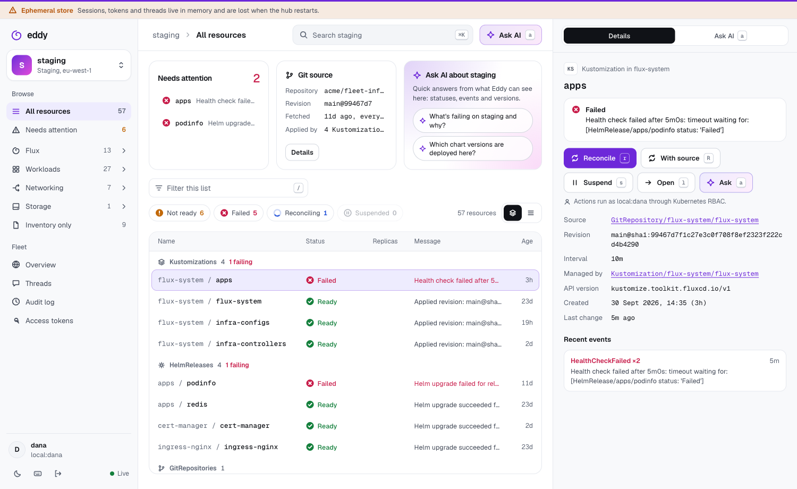

# Eddy

**A fast, keyboard-first, multi-cluster UI for [Flux](https://fluxcd.io).**

Eddy shows every Flux cluster you run in one place. You can jump anywhere with a command
palette, reconcile or suspend with a single key, and read logs, events and YAML without
leaving the keyboard. It is built as a modern open-source successor to
[weave-gitops](https://github.com/weaveworks/weave-gitops), whose open-source edition has had
no feature work since Weaveworks shut down and is limited to one cluster.

> **Status: v0.1 MVP, pre-release.** APIs, Helm values and the CRD group
> (`gitops.eddy.dev`) may change before v1.



## Why Eddy

- **Multi-cluster in the open-source edition.** A hub runs in a management cluster and a
  light agent runs in every workload cluster. The agents dial out, so no workload API
  server is ever exposed and the hub holds no cluster credentials.
- **Fast.**
  - Agents stream summaries through informers and batched deltas.
  - The UI updates over SSE and uses virtualised lists.
  - A command palette (`⌘K`) searches every resource in every cluster.
- **Kubernetes RBAC is the permission model.** Every read and action runs impersonated as
  the signed-in user, and each cluster decides what they may do. Eddy invents no roles.
- **Safe by default.**
  - Secret and ConfigMap data never leave a cluster.
  - Protected clusters need a typed confirmation, and every action is audited.
  - AI features are read-only.
- **Built for AI-assisted operations.**
  - An MCP endpoint lets Claude Code (or any MCP client) query the whole fleet, act with
    your identity and guardrails, and leave review threads on resources.
  - Ask AI works with the Anthropic API or AWS Bedrock.

## What's in v0.1 and what's next

| Area | Ready in v0.1 | Next (v0.2+) |
|---|---|---|
| Clusters | Hub and agents over outbound WebSocket, `Cluster` CRD, token auth | mTLS for agents, `eddy register` CLI |
| Flux | Kustomization, HelmRelease, Git/OCI/Helm repositories, HelmChart, Bucket; workloads and pods; inventory tree | Image automation, notification alerts, `flux diff` view |
| Actions | Reconcile (with source), suspend, resume; typed confirmation on protected clusters | Workload restart, bulk actions |
| UI | Keyboard-first SPA (TanStack Router, Query and Virtual), `⌘K` palette, fleet overview, detail views (YAML, events, logs), dark mode | Saved views, graph view |
| Sign-in | Local users (argon2id); trusted reverse-proxy headers (oauth2-proxy, Pomerium) | **GitHub OAuth2, OIDC (Google, Okta, Entra, Dex), SAML 2.0** |
| Access tokens | Personal access tokens (`read` / `operate`, mandatory expiry) for MCP | MCP OAuth 2.1, per-cluster scoping |
| MCP | `/mcp` with fleet-wide read tools, guarded actions and thread tools | Log follow, subscriptions |
| Threads | Review threads on any resource or cluster, from people, Claude Code and Ask AI | Mentions, notifications, webhooks |
| Ask AI | Anthropic API or AWS Bedrock (IRSA, Guardrails), read-only tools, redaction | Streaming answers |
| Storage | SQLite on a PVC (single replica); memory for dev | Postgres backend, multi-replica hub |
| Ops | Helm charts, internal ingress examples, audit log, runtime kill switches | Prometheus dashboards, audit webhook |

## Architecture

```
 Browser (TanStack SPA) ─┐                       ┌─ Claude Code / MCP client
   session cookie, SSE   │                       │   Bearer eddy_pat_…
                         ▼                       ▼
            ┌──────────────── Hub (management cluster) ────────────────┐
            │  :8080  UI · /api · /auth · /mcp       (internal ingress)│
            │  :8443  /agent/v1/connect              (agent endpoint)  │
            │  SQLite: sessions · tokens · threads · audit             │
            │  K8s:    Cluster CRs · agent token Secrets               │
            └────────────▲────────────────────────────▲────────────────┘
                         │ WebSocket (agent dials out)│
            ┌────────────┴───────────┐    ┌───────────┴────────────┐
            │ Agent · prod-eu        │    │ Agent · staging        │
            │ informers, summaries,  │    │ impersonated reads and │
            │ impersonated actions   │    │ actions, read-only SA  │
            └────────────────────────┘    └────────────────────────┘
```

Design decisions are recorded in [`docs/adr/`](docs/adr), and the API contract is in
[`docs/api.md`](docs/api.md).

## Quickstart (kind, about 5 minutes)

Requirements: Docker, [kind](https://kind.sigs.k8s.io), `kubectl`, `helm`, `flux` and
[Task](https://taskfile.dev).

```sh
task kind:up      # kind cluster + Flux + a demo app + the Eddy hub and agent
kubectl -n eddy port-forward svc/eddy-hub 8080:80
open http://localhost:8080   # sign in as the dev user printed by the script
```

For production installs, including internal ingress, local users, proxy auth, Bedrock and
backups, see **[docs/install.md](docs/install.md)**.

## Connect Claude Code

Create a token under **Settings → Access tokens**. Then run:

```sh
claude mcp add --transport http eddy https://eddy.internal.example.com/mcp \
  --header "Authorization: Bearer eddy_pat_…"
```

Then ask, for example: *"Review every failing HelmRelease across the fleet and leave a thread
on each one with the likely cause."* See [docs/mcp.md](docs/mcp.md) for the tools, scopes and
guardrails.

## Security model

- Agents only dial out. The agent's ServiceAccount is read-only, apart from `impersonate`
  and SubjectAccessReviews.
- Every request is impersonated as the user. `system:*` users and groups are never
  impersonated, and groups are prefixed `eddy:`.
- Only resource summaries reach the hub. YAML views drop Secret data, `managedFields` and
  env values.
- Tokens are hashed at rest, sessions are server-side, CSRF is enforced, and the CSP is strict.
- AI and MCP output is redacted and wrapped as untrusted data. AI has no write tools. MCP
  writes need the `operate` scope and typed confirmation on protected clusters, and can be
  switched off at runtime.

Details: [docs/security.md](docs/security.md). To report a vulnerability, see
[SECURITY.md](SECURITY.md).

## Development

```sh
task dev:hub      # hub on :8080/:8443 with the memory store and fake login (-tags dev)
task dev:agent    # agent against your current kubecontext
task ui:dev       # Vite on :5173, proxying to the hub
cd web && VITE_MOCK=1 pnpm dev   # UI only, with mocked data
task check        # lint + tests + UI build; run before a PR
```

`CLAUDE.md` holds the conventions and security invariants used by contributors and by
Claude Code.

## Contributing

Contributions are welcome. Read [CONTRIBUTING.md](CONTRIBUTING.md) and the
[code of conduct](CODE_OF_CONDUCT.md). Commits use Conventional Commits.

## License

[Apache License 2.0](LICENSE).
