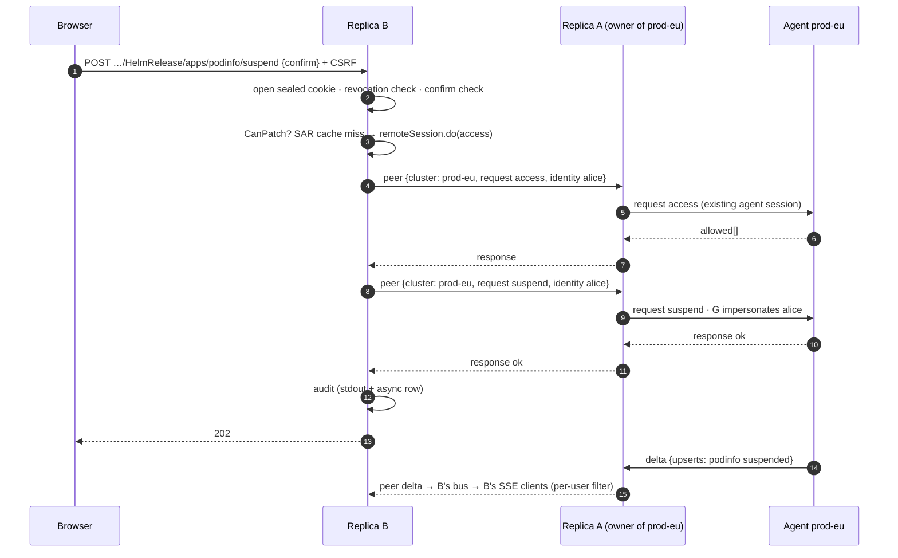
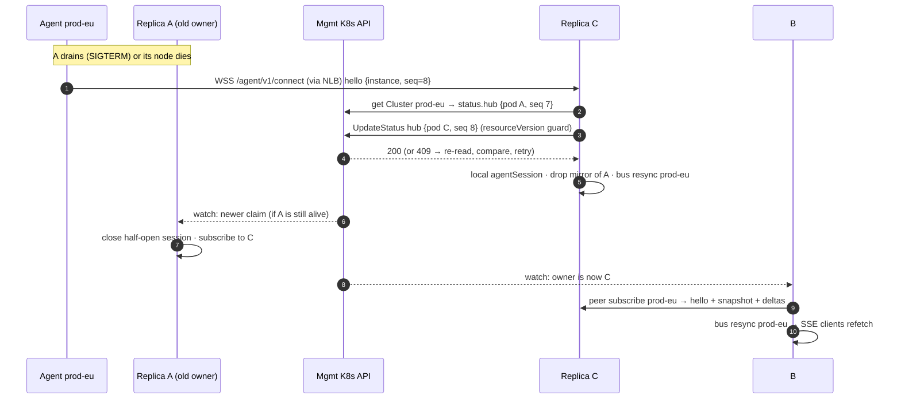

# ADR-0004: High availability (multiple hub replicas)

- **Status:** Proposed · **Date:** 2026-09-30 · **Target:** v1.0.0
- **Amends:** ADR-0002 (sessions leave the store; `postgres` driver; chart replica rule), ADR-0003 §3.2 (session cookie), `internal/protocol` (additive `Hello` fields)

## Context

ADR-0002 made the hub a single replica with SQLite on an RWO PVC, and left open the question of HA. The owner wants the replica design settled before v1.0. The owner's direction is: keep SQLite, let users bring their own Postgres (CloudNativePG, RDS, Cloud SQL and so on), use no Postgres-specific features, and question whether a database layer is needed at all.

This ADR questions the assumption that HA needs a database. It takes each piece of hub state, asks where that state must live when N replicas run, and prefers answers that add **no new mandatory infrastructure**. Today's single hub holds three kinds of state:
- **Memory:** agent sessions, cluster views, the SAR cache, rate limiters and the SSE bus.
- **SQLite:** sessions, PATs, threads, audit and prefs.
- **Kubernetes:** Cluster CRs, Secrets and the runtime ConfigMap.

## Decision

1. **Replicas are active/active, and no replica is special.** Replicas do not elect a leader. Every replica serves the UI, `/api`, SSE, `/mcp` and the agent endpoint. A replica that does not hold a cluster's agent connection relays to the replica that does, over an authenticated peer channel.
2. **Browser sessions become stateless sealed cookies.** The `sessions` table is dropped. Revocation uses a small `revocations` table that each replica caches in memory.
3. **Only user-generated durable content needs a shared database.** That content is threads, messages, prefs, PAT rows, revocations and audit rows. The code has one SQL store with two dialects:
   - `sqlite`: the default. It requires `replicaCount: 1`.
   - `postgres`: bring your own. It is **required for `replicaCount > 1`**.

   Both dialects run the same DML. Only the DDL files differ.
4. **Coordination uses no database and no Lease.** Cluster ownership is recorded in the `Cluster` CR's `status.hub`, written with optimistic concurrency. Peers find each other through a headless Service.
5. **Stdout JSON stays the audit of record.** Audit rows in the store are an asynchronous, best-effort copy that backs `GET /api/v1/audit`.
6. **Abuse limits are enforced per replica** and documented as N× the configured value. The Ask AI hourly quota costs money, so it is counted in the store and is global.

### State placement

| State | Single replica today | HA location | Why |
|---|---|---|---|
| Browser session | `sessions` row | **Sealed cookie** (client) | It is needed on every request. A cookie removes a store round trip and survives a store outage. |
| Session revocation (logout, logout-everywhere, `admin revoke`) | row delete | `revocations` rows, cached in memory on each replica, pushed over the peer channel and polled every 15 s | Revocations are rare and small. A stale cache is safe for ≤15 s. |
| CSRF, pre-session | derived (HMAC) | unchanged | Already stateless. Every replica has the same key Secret. |
| Local users, password change | Secret + row delete | Secret + a password fingerprint in the cookie | A new hash invalidates the cookie with no write. |
| PATs | `api_tokens` rows | unchanged, shared DB | Listing, revocation, `last_used` and the per-user limit all need a record (see below). |
| Proxy users' latest groups (PAT shrink) | `Sessions.LatestGroups` | new `users_seen(subject, groups, seen_at)` upsert, throttled to 1/min | The same data without session rows. |
| Threads, messages, prefs | SQLite | **shared DB** | Durable user content. Nothing else holds it. |
| Audit | stdout + SQLite | stdout (record) + async batched rows in the shared DB | The query UI is a convenience. Log shipping is the long-term path. |
| Cluster views (summaries) | agent session memory | owner: agent session. Others: a mirrored copy fed by the peer channel | Every replica serves full lists and SSE locally. |
| Cluster ownership | implicit | `Cluster.status.hub {pod, addr, instance, seq, since}` | The hub already watches Clusters and patches their status. `kubectl get` shows it. |
| SAR cache | memory, 45 s | memory, per replica | Worst case is N× SAR traffic. No sharing is needed. |
| Rate limits, lockouts, MCP limits | memory | memory, per replica (N× effective) | These are abuse guards, not quotas. |
| AI per-user hourly quota | memory | count of `author_type='ai'` messages by the user in the last hour | It is a cost cap, and every ask already writes a message. |
| SSE subscribers, log streams | memory | memory, per replica | Each connection belongs to one replica. |
| Thread-change notifications | local bus | local bus + peer broadcast | No Postgres LISTEN/NOTIFY (owner: no PG features). |

### Sessions: sealed cookies

- **Cookie:** `__Host-eddy_session = base64url(v1 ‖ nonce24 ‖ XChaCha20-Poly1305(k_session, payload, ad="eddy-session-v1"))`.
  - `k_session` = HKDF(hub key, info `session-seal`).
  - The payload is `{sid16, sub, display, prov, iat, seen, pwfp?, groups? (dev only)}`.
  - XChaCha20-Poly1305 (`golang.org/x/crypto/chacha20poly1305.NewX`, already a module dependency) is chosen over AES-GCM because a 192-bit random nonce removes any nonce-count limit for cookies that are re-sealed every minute.
- **Groups stay out of the cookie.** Local users' groups already come live from `users.yaml`, and proxy users' groups come from the headers on each request. This keeps the cookie under 1 KiB even with `maxGroups: 64`.
- **Timeouts:**
  - Idle: the hub re-seals the cookie with a new `seen` on any response when `now − seen ≥ 1 min`.
  - Absolute: `iat + 24h`, checked on every request.
- **CSRF** stays `HMAC(k_csrf, sid)`. The id still rotates on login.
- **Revocation:**
  - Single logout inserts `(sid_hash, expires_at = iat + absolute)`.
  - Logout-everywhere, `admin revoke` and disabling a user insert `(subject, not_before = now)`. A cookie is rejected if its `iat < not_before`.
  - Password change needs no row, because `pwfp = HMAC(k_session, passwordHash)[:8]` no longer matches.
  - The janitor deletes rows once `now > absoluteTimeout` past them.
  - Each replica loads the whole table at start, listens for peer `revoke` pushes, and polls `WHERE created_at > ?` every 15 s. **The staleness window is ≤15 s**, and near 0 when the peer channel is up.
  - If the store is unreachable, replicas keep using the last known set. This is safe because new revocations need the store too.
- **Rejected homes for the revocation epoch:**
  - A ConfigMap or Lease annotation would need write RBAC on Kubernetes objects and would duplicate state that the DB already holds.
  - A Cluster CR has the wrong scope.
- **What is lost:** `session.maxPerUser` can no longer be enforced. The key is still accepted, but the hub logs a WARN and ignores it. The "active sessions" list is gone too, though it was never exposed in the API. Rotating the hub key logs everyone out. `previousKeyFile` is deferred.

### PATs stay rows

Stateless PATs would have to embed the subject, scopes, expiry and groups. That breaks the `eddy_pat_[0-9A-Za-z]{50}` format that secret scanners rely on. They would still need a denylist that lives for up to 90 days, and "list my tokens", `last_used` and the per-user limit of 10 would all still need a record. A record is simply a row.
- **Verify cache:** a replica caches a successful verify by token id for 30 s, the same bound as ADR-0002. A peer `revoke` push evicts the entry at once.
- **Store outage:** on a store error, a cached entry stays valid for up to 10 minutes (stale-if-error). This is safe because a revocation cannot be written while the store is down. Disabling a local user still takes effect, since that is checked live against `users.yaml`.
- **`MarkUsed`:** stays throttled to 5 min per replica, so it costs N× a trivial write.
- **Per-user limit:** the check is count-then-insert, so replicas racing on create can exceed 10 by at most N−1. This is documented as a soft limit.

### Threads and the store: one SQL implementation, two dialects

- **Package layout:** `internal/store/sqlstore` holds the `database/sql` implementation, written once. `sqlite` and `postgres` become dialects that provide:
  - the DSN and connection pool setup
  - `rebind` (`?` → `$n` for pgx)
  - error classification (SQLite 2067 / PG `23505` → `ErrConflict`)
  - the migration lock
  - backup hooks
  - DDL under `migrations/{sqlite,postgres}/NNNN_*.sql`, with the same version numbers
- **Driver:** `github.com/jackc/pgx/v5/stdlib`, registered as `"pgx"`. It is the maintained, dominant pure-Go driver. `lib/pq` was not chosen, because pgx gives better error types (`*pgconn.PgError.Code`) and one fewer driver to track.
- **Portability rules**, enforced by a review checklist and by `storetest` running against both backends in CI (Postgres in a service container):
  - Write placeholders only as `?`, and rewrite them once at prepare time. Never write `$1`: SQLite treats `$1` as a *named* parameter numbered by order of appearance.
  - Declare every time column as `BIGINT` in the PG DDL. PG's `INTEGER` is 32-bit, and unix milliseconds overflow it.
  - `STRICT` exists only in SQLite DDL. Use `BLOB` in SQLite and `BYTEA` in PG. `AUTOINCREMENT` becomes `BIGINT GENERATED ALWAYS AS IDENTITY`. `length(CAST(x AS BLOB))` becomes `octet_length(x)`.
  - Generated ids are read with `RETURNING` (SQLite ≥ 3.35, and modernc v1.60 bundles 3.53). Never use `LastInsertId`, which pgx does not support.
  - Upserts use `INSERT … ON CONFLICT (col) DO UPDATE SET c = excluded.c`, which both engines accept.
  - Keyset cursors use row values `(updated_at, id) < (?, ?)`. Partial indexes, `CHECK` constraints and JSON stored as `TEXT` (not `jsonb`) all work in both engines.
  - Replace read-then-write under PG's READ COMMITTED with conditional updates. For example, `AddMessage` runs `UPDATE threads SET message_count = message_count + 1, updated_at = ? WHERE id = ? AND message_count < 1000` and checks the rows affected.
  - No `LIKE`, since case sensitivity differs between the engines. Search stays in Go.
  - PRAGMAs, `VACUUM INTO` and `PRAGMA optimize` live only in the SQLite dialect.
  - Migrations on PG run inside one transaction with `LOCK TABLE schema_migrations IN ACCESS EXCLUSIVE MODE`, so N replicas starting together apply each migration once. This is standard SQL-ish DDL and needs no advisory-lock API. The downgrade guard is unchanged.
- **The janitor runs on every replica with a random 0–10 min offset.** Its deletes are batched and idempotent, so no leader is needed.
- **Why not "SQLite leader + proxy"** (option a): a pod cannot mount a PVC at runtime, so "leadership moving with the RWO PVC" would really mean a separate one-pod StatefulSet serving a custom store RPC of about 30 methods. On node loss, the PVC is force-detached only after about 6 min (Kubernetes' non-graceful shutdown timeout), unless someone applies the `out-of-service` taint by hand. That is a hand-built distributed system that still leaves a single point of failure with minute-scale failover. It is rejected in favour of a Postgres that an operator already runs or that CNPG gives in about 20 lines of YAML.
- **Litestream** is a single-writer backup and DR tool, not replication for multiple writers. It stays an optional backup sidecar for single-replica SQLite.

### Agent relay

- **Ownership:**
  - When an agent authenticates on replica A, A writes `status.hub = {pod: A, addr: <podIP>:8444, instance, seq, since}` with `UpdateStatus` carrying the read `resourceVersion`, and retries on 409.
  - `Hello` gains `instance` (a random id per agent process) and `seq` (a counter per dial). **The newest connection wins:**
    - For the same `instance`, the higher `seq` wins.
    - For different instances, the later `since` wins. Two agent pods for one cluster is a misconfiguration and flaps today too.
  - A replica never overwrites a newer claim with an older one.
  - Old agents without these fields fall back to hub-observed time.
  - The status writer patches connection fields only for clusters the replica owns, guarded by the same comparison.
- **Handover:** every replica watches Clusters. When A sees a newer claim for a cluster it serves locally, it closes its session ("replaced on another replica") and switches to a remote mirror. This reuses today's same-replica rule in `agents.add`, applied across replicas.
- **Peer channel:**
  - **Listener:** `:8444` serves `/peer/v1/connect` only. It 404s every other route, and the other listeners 404 it.
  - **Discovery:** DNS of the headless Service `<fullname>-peers` (`publishNotReadyAddresses: true`), resolved every 10 s. Each pair of replicas shares one WebSocket, dialled by the lexically smaller pod name.
  - **Authentication:** `Authorization: EddyPeer <pod>:<unix>:<HMAC(k_peer, pod‖unix‖targetPod)>`. `k_peer` = HKDF(hub key, info `peer`), with ±60 s skew allowed and a constant-time compare. A NetworkPolicy admits `:8444` only from pods with the hub's selector labels.
  - **Encryption:** traffic is plaintext inside the cluster, like the ingress→hub hop. mTLS is deferred, and a service mesh can wrap the channel today.
- **Remote session:** `internal/hub` gains a `clusterSession` interface that both `*agentSession` and `*remoteSession` implement: `view`, `lookup`, `tupleCounts`, `do`, `stream`, `hello` and `closed`.
  - The fleet service, the authorizer and SSE use only this interface, so they do not change.
  - A peer frame is `{cluster, frame}` wrapping the existing `protocol.Frame`, with new types `subscribe`, `unsubscribe` and `broadcast` (`thread`, `revoke`).
  - When B subscribes to cluster X on A, A replies with `hello` + `snapshot` (chunked exactly as agents chunk it), then forwards X's unfiltered bus events as `delta`/`resync`.
  - Relayed `request` frames carry the caller's `protocol.Identity`. A runs them on the agent session and relays `response`/`stream`/`streamEnd` back. `cancel` propagates, and a peer disconnect cancels everything in flight.
  - The agent re-validates identity as it does today (no `system:*`, only `eddy:` groups), so a compromised peer key is bounded the same way a compromised hub is.
- **SSE:** each replica feeds its own bus from local and remote sessions alike, so per-user filtering, `resync` and the `clusters` events work unchanged.
- **Readiness:** a replica is ready when all of these hold: the store has migrated, the registry has synced, it has peer links to every discovered peer, and it has mirrors for every cluster whose owner is reachable.

### Failure modes

| Failure | Effect | Recovery |
|---|---|---|
| Replica pod dies (graceful drain) | Its agents reconnect elsewhere (backoff ≤30 s, usually 1–2 s). Its SSE and MCP clients reconnect through the Service. | New claims appear in status and peers re-subscribe. Only its 1/N of clusters blink. |
| Node dies (no FIN) | Agents on that replica notice after the agent ping or idle timeout (20 s ping, 90 s hub idle). Peers see peer DNS drop within about 30 s. | A peer that cannot reach the owner, and whose DNS no longer lists it, CASes the cluster to `Disconnected`. Consider lowering agent idle detection to about 45 s. |
| Two replicas both hold a connection (half-open) | For ≤1 watch latency, requests may go to the dead one and time out with a 503 `disconnected`. | The newer `(instance, seq)` wins and the older connection is closed. Writes are never applied twice: at most one live socket gets each request. |
| Peer link down, owner alive | B marks the owner's clusters disconnected in its own view. Its users see those clusters as disconnected. | The link redials with backoff. Readiness fails if the outage exceeds 30 s, so the Service drains B. |
| Postgres down | Threads, prefs, token create/list and audit query return 503. **Login, SSE, lists, actions and MCP keep working** (sealed cookies, cached PATs, stdout audit). | Automatic reconnect. The audit batch buffer (10k events) drops the oldest and increments `eddy_audit_store_dropped_total`. |
| Hub key Secret differs between pods | Cookies and peer auth fail across replicas. | The chart mounts one Secret. Every replica logs a key fingerprint at start, and readiness fails on a peer auth mismatch. |
| Rolling upgrade with mixed versions | The peer protocol is versioned (`peer/v1`). An older peer rejects unknown frame types. | Only additive changes are allowed within v1. Migrations stay expand-only across one minor version. |

### Effective limits with N replicas (documented in install.md)

- Login per username becomes 5N failures per 15 min, and login per IP becomes 20N per minute. Both still sit behind argon2id plus the concurrent-hash cap on each replica.
- MCP per token becomes 60N calls per minute and 4N concurrent. Writes become 10N per minute.
- Agent auth failures become 10N per minute per IP.
- The Ask AI hourly quota stays exact (store count). AI concurrency becomes 1 per user per replica.

## Code changes (rough size, excluding tests unless noted)

| Package | Change | Size |
|---|---|---|
| `internal/store` | Replace `Sessions` with `Revocations` (`AddSession`, `AddSubject`, `Since`) and `Seen` (`Put`, `Groups`). Add the `Dialect` seam. | ~80 |
| `internal/store/sqlstore` (new) | Move the SQLite DML here, apply the portability rules above, add conditional updates. | ~150 net (mostly a move) |
| `internal/store/{sqlite,postgres}` | Dialects. Add migration `0002`: drop `sessions`, add `revocations` and `users_seen`. Add the PG `0001`/`0002` DDL. Add pgx. | ~250 |
| `internal/store/storetest` | Add a PG run in CI, plus concurrency cases (message cap, migration race). | ~200 tests |
| `internal/auth` | Sealed cookie codec, revocation cache, `pwfp`, `users_seen` in place of `LatestGroups`, PAT verify cache with stale-if-error. Remove `maxPerUser` enforcement. | ~350 (+300 tests) |
| `internal/protocol` | Additive `Hello.Instance`/`Seq`. Add `peer.go` with the `PeerFrame` types. Update `docs/api.md`. | ~60 |
| `internal/agent` | Send `instance` and `seq`. | ~15 |
| `internal/hub` | `clusterSession` interface, `remoteSession`, peer server and client with HMAC auth and discovery, ownership claims in `registry_kube` and `status.go`, broadcasts for thread and revoke events, readiness, an async audit batcher, an AI quota from the store. | ~1,200 (+700 tests, `-race`) |
| `internal/config` | `store.driver: postgres`, `store.postgres.dsnEnv`, `listen.peer` (default `:8444`), `ha.peerService`, and the pod IP and name from the downward API. Validation: replicas > 1 needs postgres (the chart enforces this). | ~60 |
| `deploy/charts/eddy-hub` | See below. | ~150 |

**Chart:**
- `replicaCount`: `fail` if the value is > 1 while the driver is `sqlite`.
- Driver-specific settings:
  - `postgres`: `strategy: RollingUpdate` (maxSurge 1, maxUnavailable 0) and no PVC.
  - `sqlite`: `Recreate` plus the PVC, as today.
- **Scheduling:** a PDB (`maxUnavailable: 1`, rendered only when replicas > 1), `topologySpreadConstraints` over zone and hostname (ScheduleAnyway), and preferred pod anti-affinity.
- **Peer networking:** the headless Service `<fullname>-peers` on port 8444 with `publishNotReadyAddresses`, and a NetworkPolicy rule for 8444 from the hub pods.
- **Downward API:** `POD_NAME` and `POD_IP`.
- **Values:** `store.postgres.existingSecret`/`key` rendered as an env DSN (`sslmode=verify-full` is recommended, and the docs show a CNPG `Cluster` and its `-app` Secret).
- **RBAC:** add the verbs `get` and `update` on `clusters/status`, next to the existing `patch`. No Lease, ConfigMap or Secret write RBAC is added.

## Answer to the owner: "what will be on the Postgres layer, maybe we don't even need one"

**Postgres holds exactly these:** threads, messages, user prefs, PAT rows, the revocations table, `users_seen`, and a convenience copy of audit.
- It holds no sessions, no cluster state, no coordination, no pub/sub and no cache.
- It uses plain SQL that SQLite runs too, so any Postgres ≥ 13 works (CNPG, RDS, Cloud SQL, Azure, Neon) with no extensions and no LISTEN/NOTIFY.

**Whether you need one:**
- One replica does not need it: SQLite on a PVC stays the zero-infrastructure default.
- More than one replica does need it, and only because threads and PAT records are durable user data that must survive losing any single pod or node. No existing component can hold that data safely.
- Everything else HA needs comes from the cookie, the Kubernetes objects we already have, and replica memory.

The only ways to drop the database for HA are to build replication ourselves (Raft or a store-owner RPC with a failover of minutes) or to let threads and PATs be lost. Both are worse than "bring any Postgres".

## Consequences

- **Positive:**
  - HA adds no mandatory infrastructure beyond a database the user chooses.
  - Auth and the fleet view keep working through a database outage.
  - Losing a pod affects only 1/N of clusters for seconds.
  - Upgrades are zero-downtime rolling updates on Postgres.
  - One DML codebase is tested against both engines.
- **Negative:**
  - Relay and ownership code (about 1.2k lines) sits in the most concurrency-sensitive package, so Opus-reviewed tests with `-race` are needed.
  - Rate limits become N×.
  - `maxPerUser` for sessions is gone.
  - SQLite installs stay single-replica.
  - CI gains a Postgres service.

## Alternatives considered

| Option | Verdict | Why |
|---|---|---|
| Active/passive (Lease leader serves, standby waits) | Rejected | A NotReady standby makes the PDB block draining the leader's node (healthy 1 of 2 ⇒ 0 disruptions allowed). A Ready standby that forwards would have to proxy agent WebSockets and forward signed proxy-auth identity, which is half of a relay anyway. Every failover blacks out all clusters for the lease plus reconnect time (15–45 s), and it does not scale SSE or SAR load. It still needs Postgres. |
| Agents connect to every replica | Rejected | Agents reach the hub through one NLB or ingress hostname across VPCs, so pod IPs are not routable and exposing each replica would widen the attack surface. It also costs N× snapshots and deltas per cluster, and gives no ordering between replicas for actions. |
| A Lease per cluster (`coordination.k8s.io`) | Rejected | It needs renewals (200 clusters at 10 s = 20 writes/s) and new RBAC. Ownership only changes on reconnect, so a CAS'd pointer in `Cluster.status` is enough and is visible with `kubectl`. |
| SQLite store leader + proxying (a) | Rejected (see above) | A PVC cannot follow leadership. A node-loss force detach takes about 6 min. It needs a custom RPC. |
| Threads as Kubernetes objects (c), revisited | Rejected again | HA makes etcd the only store that is free, durable and multi-writer. The ADR-0002 blockers still stand: the 1.5 MiB object limit, no ordering or keyset by `updated_at`, write and watch fan-out, and user text (possibly pasted secrets) readable by anyone with namespace `get`. Kubernetes keeps only coordination, via `Cluster.status`. |
| rqlite, dqlite, or embedded Raft (hashicorp/raft + SQLite) | Deferred / rejected | rqlite is new infrastructure. Embedded Raft needs a quorum of 3, snapshots and membership changes, which is too much for v1.0. |
| Redis for sessions and pub/sub | Rejected | Sealed cookies plus the peer channel cover both, with no new infrastructure. |

## Explicitly deferred (post-1.0)

- mTLS on the peer and agent channels
- `auth.previousKeyFile` for key rotation without logging users out
- MySQL or other dialects
- a SQLite HA story
- a shared SAR cache
- a global login lockout (store-backed)
- an audit webhook or SIEM sink
- consistent-hash routing of agents at the ingress (it would reduce ownership churn)

## Verified facts (2026-09-30)

- The pgx stdlib driver registers as `"pgx"` (`sql.Open("pgx", dsn)`) and supports only `$1` positional parameters. https://pkg.go.dev/github.com/jackc/pgx/v5/stdlib
- In SQLite, `?`, `?NNN`, `:A`, `@A` and `$A` are parameter forms. Named parameters get "one greater than the largest parameter number already assigned", so `$2 … $1` would bind in the wrong order. https://www.sqlite.org/lang_expr.html#varparam
- The bundled SQLite is 3.53.4 (modernc v1.60.1 `doc.go`). `RETURNING` needs ≥ 3.35 and `ON CONFLICT DO UPDATE` needs ≥ 3.24.
- Non-graceful node shutdown force-detaches volumes after a 6 min timeout, or sooner once an operator applies the `node.kubernetes.io/out-of-service` taint. https://kubernetes.io/docs/concepts/cluster-administration/node-shutdown/
- PostgreSQL `INTEGER` is 4 bytes. Unix-millisecond times need `BIGINT`.
