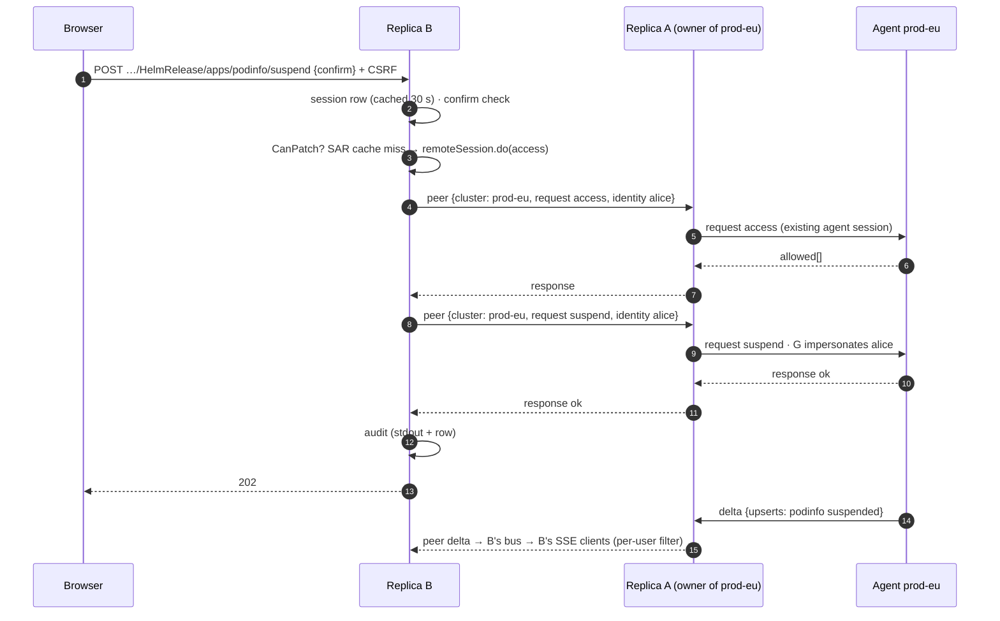
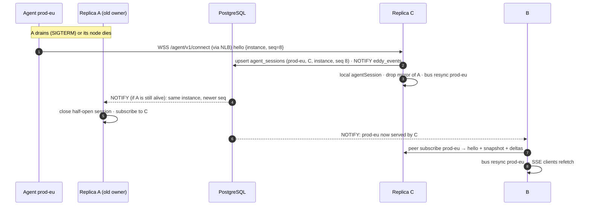

# ADR-0004: High availability: PostgreSQL store, active/active hubs, agent replicas

- **Status:** Accepted · **Date:** 2026-09-30 · **Target:** v1.0.0
- **Supersedes:** ADR-0002 (the SQLite store) and the parts of ADR-0003 that assume one replica
- **Amends:** `internal/protocol` (additive `Hello` fields), the `eddy-hub` and `eddy-agent` charts

## Context

The owner wants replicas designed in from day one, for both hubs and agents. This ADR records the owner's decision:

- The hub is not a high-load service. Even 3–5 operators at once is a small load, and HA matters more than the extra infrastructure.
- **PostgreSQL is the store.** Deployments bring their own: CloudNativePG, RDS, Cloud SQL and so on. **SQLite is removed.**
- **UNLOGGED tables** hold throwaway state (sessions, rate-limit counters). A crash may truncate them. They avoid WAL cost and replication lag, and losing them only logs people out or resets a limit window.
- **No Valkey or Redis.** It would add infrastructure to buy a speed we don't need.
- **Cluster data is never stored in the database.** Kubernetes and the agents' informer caches hold it. Each hub replica keeps an in-memory view, relayed from whichever replica holds an agent connection. Sharing "what user A already fetched" with user B through a database was considered and rejected: it adds staleness and a larger blast radius for little gain.
- **Agents are transport, not storage.** Running 2+ agent replicas per cluster is HA for the agent layer. They still represent **one** cluster.
- **Eddy must never overload a cluster's control plane.** Limits must hold for the fleet as a whole, whatever the number of hub or agent replicas.

## Decision

1. **The store is PostgreSQL only.** It is implemented as `internal/store/postgres` on `database/sql` with `pgx/v5/stdlib`. `internal/store/memory` stays for unit tests and `task dev` local mode. `internal/store/sqlite` is deleted.
2. **Durable data goes in LOGGED tables:** threads, messages, api_tokens, audit_events, user_prefs.
3. **Throwaway data goes in UNLOGGED tables:**
   - `sessions`: server-side rows, as in ADR-0003. Revocation is immediate. No sealed cookies.
   - `rate_limits`: fixed-window counters shared by every replica, covering login per user and per IP, MCP calls and writes per token, and Ask AI per user.
   - `agent_sessions`: which hub replica holds which agent connection, with a heartbeat.

   A PostgreSQL crash truncates these tables. Users sign in again and limit windows reset.
4. **Hub replicas are active/active.** Each serves the UI, API, SSE, MCP and the agent endpoint. A replica without a direct agent session for a cluster relays to one that has one, over the peer channel (see Agent relay).
5. **1 to N agent replicas per cluster, all active.**
   - Every agent replica watches and connects, and the hub accepts several sessions per cluster.
   - The hub builds **one** cluster view from a primary session: the oldest healthy local one, or else a remote one. The others are hot standbys.
   - Requests go to the primary, and fail over to another session on disconnect.
   - The agent chart defaults to 2 replicas, with anti-affinity and a PDB.
   - The cost is N× watch connections to the API server. Watches are cheap, and summaries are deduplicated by resource id.
6. **Control-plane protection is enforced in the agent**, the component closest to the API server:
   - client-go `QPS`/`Burst` on the base and impersonating clients (defaults 20/40)
   - a per-agent concurrency cap on user requests (default 16)
   - a log-stream cap (default 8)
   - a SubjectAccessReview batch cap

   Every cap is divided by the agent's replica count through config. Hub-side global limits in `rate_limits` protect the hub and the AI budget.
7. **Peers coordinate through PostgreSQL:**
   - `agent_sessions` replaces the Cluster `status.hub` idea from the draft. It is a portable table and needs no extra Kubernetes RBAC.
   - Thread and revocation fan-out uses `LISTEN/NOTIFY` on channel `eddy_events` (payload ≤ 8 KB: ids only). Replicas re-read rows as needed, and a 15 s poll is the fallback.
   - The peer WebSocket (`:8444`) carries only relayed agent traffic.

## State placement

| State | Where | Table kind | Notes |
|---|---|---|---|
| Browser sessions | `sessions` | UNLOGGED | sha256 of the id, 8h idle / 24h absolute. A crash logs everyone out. |
| Rate-limit counters | `rate_limits(key, window_start, count)` | UNLOGGED | `INSERT … ON CONFLICT DO UPDATE SET count = count + 1 RETURNING count`: one round trip, global across replicas |
| Agent session registry | `agent_sessions(cluster, hub_pod, hub_addr, agent_instance, connected_at, heartbeat_at)` | UNLOGGED | Heartbeat every 10 s, stale after 30 s |
| PATs | `api_tokens` | LOGGED | HMAC hash, scopes, expiry. The per-user limit is enforced atomically in one statement. |
| Threads, messages, prefs | `threads`, `messages`, `user_prefs` | LOGGED | Durable user content |
| Audit | `audit_events` + stdout JSON | LOGGED | stdout remains the record of truth |
| Cluster views | memory on each replica | — | Never stored in a database |
| SAR cache | memory on each replica, 45 s | — | At worst N× SAR checks, bounded by the agent's caps |
| SSE subscribers, log streams | memory on the owning replica | — | |

## PostgreSQL requirements

- **Version:** PostgreSQL 14 or later. Features used:
  - UNLOGGED tables
  - `ON CONFLICT`, `RETURNING`
  - `GENERATED … AS IDENTITY`
  - `LISTEN/NOTIFY`
  - partial indexes

  No extensions, no `jsonb` operators in queries (JSON is stored as text), and no stored procedures.
- **Connection:** DSN from `store.postgres.dsnSecret` (key `dsn`), or `PG*` env vars. `sslmode=verify-full` is recommended. The pool defaults to 10 connections per replica.
- **Migrations:** forward-only and embedded. One transaction per migration, holding `pg_advisory_xact_lock(<const>)`, so N replicas starting together apply each migration once. The hub refuses to start on a schema newer than itself.
- **Recommended operators:**
  - CloudNativePG (the chart docs include a 20-line `Cluster` example)
  - RDS or Aurora
  - Cloud SQL
- **Local dev:** `task dev` uses the memory store. `task dev:pg` starts a throwaway `postgres:17` container for anyone working on the store.

### Agent relay

- **Session registry:**
  - When an agent authenticates on replica A, A upserts `agent_sessions(cluster, hub_pod = A, hub_addr = <podIP>:8444, agent_instance, connected_at)` and heartbeats it every 10 s. It deletes the row on disconnect.
  - `Hello` gains `instance` (a random id per agent process) and `seq` (a counter per dial).
  - The same instance reconnecting with a higher `seq` replaces its old session, wherever that session is. **Different instances coexist:** that is agent-replica HA.
- **Primary selection:** each replica picks, per cluster, a local session if it has one (the oldest healthy one), otherwise the replica owning the oldest healthy row in `agent_sessions` (heartbeat under 30 s). It subscribes to that replica over the peer channel. The choice is re-evaluated on disconnect and on `eddy_events` notifications.
- **Peer channel:**
  - **Listener:** `:8444` serves `/peer/v1/connect` only. It 404s every other route, and the other listeners 404 it.
  - **Discovery:** DNS of the headless Service `<fullname>-peers` (`publishNotReadyAddresses: true`), resolved every 10 s. Each pair of replicas shares one WebSocket, dialled by the lexically smaller pod name.
  - **Authentication:** `Authorization: EddyPeer <pod>:<unix>:<HMAC(k_peer, pod‖unix‖targetPod)>`. `k_peer` = HKDF(hub key, info `peer`), with ±60 s skew allowed and a constant-time compare. A NetworkPolicy admits `:8444` only from pods with the hub's selector labels.
  - **Encryption:** traffic is plaintext inside the cluster, like the ingress→hub hop. mTLS is deferred, and a service mesh can wrap the channel today.
- **Remote session:** `internal/hub` gains a `clusterSession` interface that both `*agentSession` and `*remoteSession` implement: `view`, `lookup`, `tupleCounts`, `do`, `stream`, `hello` and `closed`.
  - The fleet service, the authorizer and SSE use only this interface, so they do not change.
  - A peer frame is `{cluster, frame}` wrapping the existing `protocol.Frame`, with new types `subscribe`, `unsubscribe` and `broadcast` (`thread`, `revoke`).
  - When B subscribes to cluster X on A, A replies with `hello` + `snapshot` (chunked exactly as agents chunk it), then forwards X's unfiltered bus events as `delta`/`resync`.
  - Relayed `request` frames carry the caller's `protocol.Identity`. A runs them on the agent session and relays `response`/`stream`/`streamEnd` back. `cancel` propagates, and a peer disconnect cancels everything in flight.
  - The agent re-validates identity as it does today (no `system:*`, only `eddy:` groups), so a compromised peer key is bounded the same way a compromised hub is.
- **SSE:** each replica feeds its own bus from local and remote sessions alike, so per-user filtering, `resync` and the `clusters` events work unchanged.
- **Readiness:** a replica is ready when all of these hold: the store has migrated, the registry has synced, it has peer links to every discovered peer, and it has mirrors for every cluster whose owner is reachable.

**Amendments for agent replicas:**
- Each hub replica can hold 0..N local agent sessions per cluster. It records them in `agent_sessions` rather than in `Cluster.status.hub`.
- A replica with no local session subscribes over the peer channel to the replica holding the oldest healthy session.
- "Newest wins" now applies only to the same agent **instance** reconnecting (higher `seq`). Different instances coexist as standbys.
- Cluster `status` still reports phase, versions and counts, plus `agents: <n>`.

### Failure modes

| Failure | Effect | Recovery |
|---|---|---|
| Replica pod dies (graceful drain) | Its agents reconnect elsewhere (backoff ≤30 s, usually 1–2 s). Its SSE and MCP clients reconnect through the Service. | New `agent_sessions` rows appear and peers re-subscribe. With 2+ agent replicas, the other agent session keeps the cluster connected, so nothing blinks. |
| Node dies (no FIN) | Agents on that replica notice after the agent ping or idle timeout (20 s ping, 90 s hub idle). Peers see peer DNS drop within about 30 s. | A peer that cannot reach the owner, and whose DNS no longer lists it, marks the cluster `Disconnected` once no fresh `agent_sessions` row remains. Consider lowering agent idle detection to about 45 s. |
| Two replicas both hold a connection (half-open) | For ≤1 watch latency, requests may go to the dead one and time out with a 503 `disconnected`. | The newer `(instance, seq)` wins and the older connection is closed. Writes are never applied twice: at most one live socket gets each request. |
| Peer link down, owner alive | B marks the owner's clusters disconnected in its own view. Its users see those clusters as disconnected. | The link redials with backoff. Readiness fails if the outage exceeds 30 s, so the Service drains B. |
| Postgres down | See below. | Automatic reconnect. |
| Hub key Secret differs between pods | CSRF and peer auth fail across replicas. | The chart mounts one Secret. Every replica logs a key fingerprint at start, and readiness fails on a peer auth mismatch. |
| Rolling upgrade with mixed versions | The peer protocol is versioned (`peer/v1`). An older peer rejects unknown frame types. | Only additive changes are allowed within v1. Migrations stay expand-only across one minor version. |

- **PostgreSQL unavailable:**
  - Reads of cluster data keep working from memory.
  - Sign-in, session checks, thread and token writes, and rate-limit checks fail closed with 503 `unavailable`.
  - Session checks use a 30 s in-memory cache so a short blip does not log everyone out.
- **PostgreSQL crash with UNLOGGED truncation:** everyone signs in again, limit windows reset, and the agent registry rebuilds from heartbeats within about 10 s.

## Chart changes

- **eddy-hub:**
  - `store.postgres.dsnSecret` is required. The PVC and SQLite values are removed.
  - `replicaCount` defaults to 2, with `strategy: RollingUpdate` (maxSurge 1, maxUnavailable 0).
  - PodDisruptionBudget `maxUnavailable: 1`, topology spread by zone and host.
  - A headless peer Service with `publishNotReadyAddresses`, and a NetworkPolicy rule for `:8444`.
  - RBAC is unchanged: it does not need `clusters/status` update beyond today's patch.
- **eddy-agent:**
  - `replicaCount` defaults to 2, with anti-affinity and a PDB.
  - New `limits.qps`, `limits.burst`, `limits.concurrency` and `limits.logStreams` values, divided by the replica count.

## Code changes

| Package | Change |
|---|---|
| `internal/store/postgres` (new) | the backend, migrations, `storetest` conformance |
| `internal/store/sqlite` | deleted |
| `internal/store` | `RateLimits`, `AgentSessions` and `Events` (notify/listen) sub-interfaces |
| `internal/auth` | use `store.RateLimits` for login limits |
| `internal/hub` | `clusterSession` interface, multi-session per cluster, peer relay, registry in `agent_sessions`, `eddy_events` listener, global limits |
| `internal/mcp`, `internal/ai` | limiters behind `store.RateLimits` |
| `internal/agent` | client QPS/burst, caps from config, `Hello.instance`/`seq` |
| charts, docs | as above; `docs/install.md` adds a Postgres section with a CNPG example |
| CI | a `postgres:17` service container for store tests |

## Consequences

- **Positive:**
  - Real HA for both hubs and agents, with global limits.
  - One store implementation to maintain.
  - Operators already run Postgres, and CNPG makes it a few lines of YAML.
- **Negative:**
  - Postgres is a hard dependency, even for small installs; a single CNPG instance is enough.
  - UNLOGGED data is lost on a Postgres crash. This is accepted: it only means sign in again.
  - N agent replicas mean N× watch load; the default is 2.
- **Neutral:** local dev needs no database (memory store).

## Alternatives considered

| Option | Verdict | Why |
|---|---|---|
| Active/passive (Lease leader serves, standby waits) | Rejected | A NotReady standby makes the PDB block draining the leader's node (healthy 1 of 2 ⇒ 0 disruptions allowed). A Ready standby that forwards would have to proxy agent WebSockets and forward signed proxy-auth identity, which is half of a relay anyway. Every failover blacks out all clusters for the lease plus reconnect time (15–45 s), and it does not scale SSE or SAR load. It still needs Postgres. |
| Agents connect to every replica | Rejected | Agents reach the hub through one NLB or ingress hostname across VPCs, so pod IPs are not routable and exposing each replica would widen the attack surface. It also costs N× snapshots and deltas per cluster, and gives no ordering between replicas for actions. |
| A Lease per cluster (`coordination.k8s.io`) | Rejected | It needs renewals (200 clusters at 10 s = 20 writes/s) and new RBAC. The `agent_sessions` UNLOGGED table does the same job without Kubernetes writes. |
| SQLite store leader + proxying (a) | Rejected (see above) | A PVC cannot follow leadership. A node-loss force detach takes about 6 min. It needs a custom RPC. |
| Threads as Kubernetes objects (c), revisited | Rejected again | HA makes etcd the only store that is free, durable and multi-writer. The ADR-0002 blockers still stand: the 1.5 MiB object limit, no ordering or keyset by `updated_at`, write and watch fan-out, and user text (possibly pasted secrets) readable by anyone with namespace `get`. Kubernetes keeps only coordination, via `Cluster.status`. |
| rqlite, dqlite, or embedded Raft (hashicorp/raft + SQLite) | Deferred / rejected | rqlite is new infrastructure. Embedded Raft needs a quorum of 3, snapshots and membership changes, which is too much for v1.0. |
| Redis for sessions and pub/sub | Rejected | Sealed cookies plus the peer channel cover both, with no new infrastructure. |

- **Owner decision:** SQLite as the default (the draft of this ADR) was rejected, because it forces single-replica installs and two store dialects. Sealed cookies were rejected in favour of UNLOGGED session rows, which give immediate revocation and no key-rotation logout. Valkey or Redis for sessions and limits was rejected as extra infrastructure for a low-load service.

## Explicitly deferred (post-1.0)

- mTLS on the peer and agent channels
- Read replicas for Postgres
- Sharing cluster views between replicas through the database (rejected for now; see Context)

## Verified facts (2026-09-30)

- The pgx stdlib driver registers as `"pgx"` (`sql.Open("pgx", dsn)`) and supports only `$1` positional parameters. https://pkg.go.dev/github.com/jackc/pgx/v5/stdlib
- In SQLite, `?`, `?NNN`, `:A`, `@A` and `$A` are parameter forms. Named parameters get "one greater than the largest parameter number already assigned", so `$2 … $1` would bind in the wrong order. https://www.sqlite.org/lang_expr.html#varparam
- The bundled SQLite is 3.53.4 (modernc v1.60.1 `doc.go`). `RETURNING` needs ≥ 3.35 and `ON CONFLICT DO UPDATE` needs ≥ 3.24.
- Non-graceful node shutdown force-detaches volumes after a 6 min timeout, or sooner once an operator applies the `node.kubernetes.io/out-of-service` taint. https://kubernetes.io/docs/concepts/cluster-administration/node-shutdown/
- PostgreSQL `INTEGER` is 4 bytes. Unix-millisecond times need `BIGINT`.

## Implementation notes (store, 2026-09-30)

- **`rate_limits(key, window_start, reset_at, count)`:** a window starts at a key's first
  hit, not on clock boundaries. That makes exact-length lockouts possible. A hit is still
  one statement: `INSERT … ON CONFLICT DO UPDATE … RETURNING count`.
- **`agent_sessions` rows are keyed by `(cluster, agent_instance)` and carry `seq`.** A
  higher `seq` from the same instance replaces the row, wherever it is. `Heartbeat`
  returns `ErrNotFound` once another replica has taken over, and the caller then drops
  its socket.
- **Events** carry kinds `thread`, `revoke`, `agent` and `resync`, with payloads of at
  most 1 KiB. Delivery is best effort: 256 buffered events per subscriber. After the
  LISTEN connection reconnects, subscribers get `resync`.
- **Per-user PAT limit:** not yet atomic. The HA phase adds
  `Tokens.Create(ctx, t, maxActive)` under
  `pg_advisory_xact_lock(hashtext(subject))`.
- **Migrations** take a database-wide advisory lock, so hubs using different schemas of
  one database migrate one after another. This is harmless.

## Implementation notes (HA, 2026-09-30)

- **Readiness:** `/readyz` gates only on the cluster registry having synced (migrations
  already ran at startup). Store and peer-link faults show as `ok (degraded: …)` and in
  metrics, but never mark a pod unready. Every replica would see the same fault, so taking
  all of them out of the Service would turn a partial outage into a full one.
- **Peer auth** binds the dialled and the dialling *address*, because discovery yields
  addresses, not pod names:
  `HMAC(k_peer, "eddy-peer-v1"‖"dial"‖pod‖unix‖targetAddr‖fromAddr)`. The accepter
  replies with its own MAC (mutual auth), and a 2-minute replay cache applies.
- **Failover grace:** a lost primary agent session gets 5 s for a standby or mirror to take
  over before the cluster shows as Disconnected.
- **Cluster status** is written only by the replica holding an agent session. There is no
  `broadcast` peer frame: thread and revoke fan-out uses store events only.
- **Peers are opt-in** (`peer.listen`). The chart enables them, and single-replica dev
  needs none.
