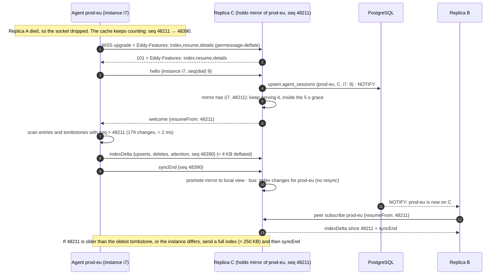
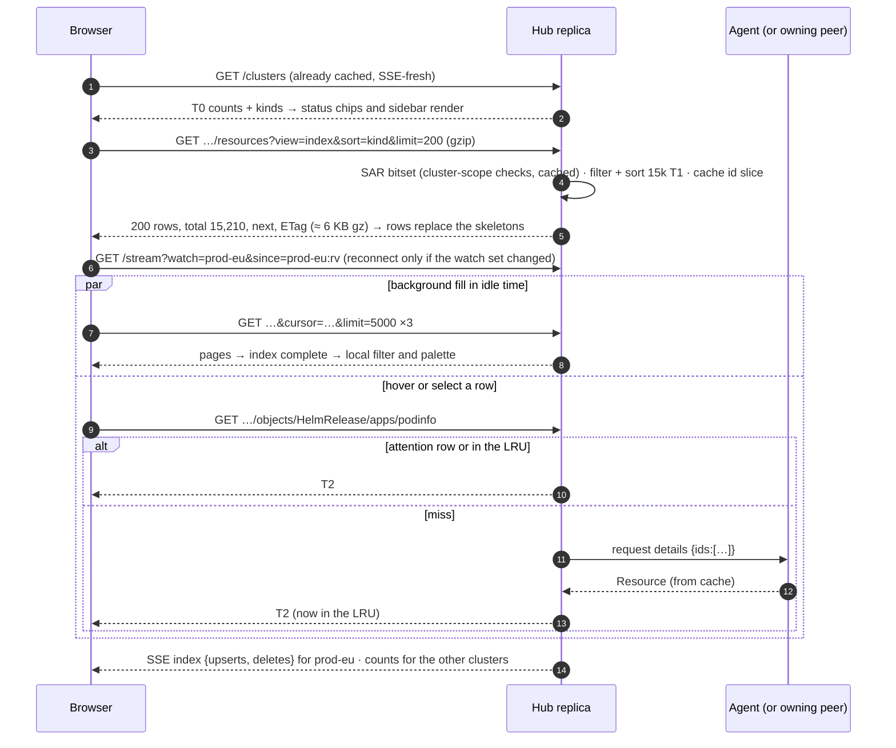

# ADR-0006: Progressive loading and efficient data transfer

- **Status:** Accepted, measurement-gated (see Owner decisions) · **Date:** 2026-09-30 · **Target:** v1.1 (P1 can ship in a v1.0.x)
- **Amends:** ADR-0001 (the snapshot and delta flow), ADR-0004 (what a hub replica keeps in memory, and the peer relay payload), `internal/protocol` (additive), `internal/model` (a new `IndexRow`), `docs/api.md`
- **Assumes:** the Job-noise change has landed. The agent hides finished Jobs except active ones, recent failures and the last N per group, adds a "Job buildup" finding row, and adds a `completed` status.

## Context

The owner's direction is: "Eddy UI must stay fast with 100+ clusters and thousands of resources each. Count first, then names, then details. Load in parts."

Measured on the owner's stage cluster (15,492 resources, 15,083 of them finished Jobs):

- `GET …/resources` returns 11.2 MB of JSON, or 716 KB gzipped. That is 768 B per resource on average.
- A slim row `{id, kind, namespace, name, status}` is about 141 B, 5.4× smaller.
- In the Go heap, one `model.Resource` takes about 1.3 KB (measured on a synthetic Job with labels, conditions, an owner and an image). A compact row takes about 300 B.

How it works today:

- **Compression:** there is no HTTP compression and no WebSocket permessage-deflate.
- **Every replica holds everything:** each hub replica holds the full summary of every cluster (ADR-0004). It also holds a second full view for each standby agent session it hosts.
- **The browser loads every cluster's full snapshot to show one page:**
  - `ClusterNav` in `Sidebar.tsx` fetches the snapshot of every connected cluster, just to count kinds.
  - `useFleetResources` does the same for the fleet page and the ⌘K palette.
  - The detail route loads the whole snapshot to find one object.
- **SSE:** it pushes every delta of every cluster to every user, and runs the per-user SAR filter on each delta.
- **The SAR cache explodes:** counts ask one SAR per `(group, resource, namespace)`.
  - With 100 clusters × ~20 kinds × ~200 namespaces, that is about 400k checks per user.
  - The shared cache holds only 100k entries (`accessMaxCached`) and batches 100 checks per request.
  - So each user thrashes the cache and sends about 4,000 access requests every 45 s.

Target load: 100 clusters × 15k resources (1.5M rows), 50 concurrent users, 3 hub replicas and 2 agent replicas per cluster.

## Decision

### 1. Four tiers of data

| Tier | Content | Agent | Hub (each replica) | Browser | Delivery |
|---|---|---|---|---|---|
| **T0 counts** | per cluster × kind × namespace × status. This is `tupleCounts`, extended with `completed`. | derives it | derived from T1 and cached per view rv (as today) | all clusters | `/clusters` and the SSE `counts` event, eager |
| **T1 index row** | `IndexRow` (below), about 200 B of JSON and 300 B of heap | derived from its cache | **every cluster**, primary and standby sessions | only the clusters on screen | pushed eagerly agent→hub; paged hub→browser |
| **T2 summary** | the full `model.Resource` (conditions, images, labels, source, URL…) | **always, since its cache already holds it** | only *attention* rows eagerly, plus an LRU of fetched rows | on select or hover | lazy (`details` op), except attention rows |
| **T3 reads** | YAML, events, logs | on demand | not kept | on demand | unchanged |

`IndexRow` (in `internal/model`, with short JSON keys) carries the columns the list renders and filters on, and nothing more:

```go
type IndexRow struct {
    Kind      string `json:"k"`           // the group is implied by the kind table (flux.KindByName)
    Namespace string `json:"ns,omitempty"`
    Name      string `json:"n"`
    Status    Status `json:"s"`
    Message   string `json:"m,omitempty"` // truncated to 120 runes
    Ver       string `json:"v,omitempty"` // short revision | chart@version | first image tag (≤64)
    Replicas  string `json:"r,omitempty"`
    Changed   int64  `json:"t,omitempty"` // unix s of LastChanged, or CreatedAt when unset
    Owner     string `json:"o,omitempty"` // owner id, so trees and children work without T2
    Terms     string `json:"x,omitempty"` // hosts / chart / extra images for text search, ≤96 B
    Flags     uint8  `json:"f,omitempty"` // 1 suspended · 2 inventoryOnly · 4 finding
    Seq       uint64 `json:"q"`           // the agent's change sequence (replaces resourceVersion ordering)
}
```

**What counts as attention (T2-eager).** A row needs attention when either of these holds:
- Its status is `failed`, or it is a Flux kind with status `reconciling` or `suspended`.
- It is a finding (`Flags & 4`).

Two limits apply:
- The cap is 2,000 eager T2 rows per cluster. Beyond that, T2 is lazy.
- The hub LRU for T2 is capped at 64 MiB per replica. An entry is invalidated by any T1 delta for its id.

**Why T2 stays on the agent.** The alternative, where every hub replica keeps T2 for everything, costs 1.5M × 1.3 KB ≈ **2.0 GB per replica**. Standby views of local sessions add about 0.65 GB more, and that is paid ×3 replicas.

The agent already holds T2 in `Cache.resources`, so keeping it there costs nothing new. A detail fetch that misses the LRU costs one extra hop of 20–80 ms: hub → (peer →) agent → hub, from memory, with no API-server call.

### 2. Agent→hub protocol

**Compression.**
- Use permessage-deflate, `CompressionContextTakeover`, on the agent endpoint and on the peer channel. Set it in `DialOptions.CompressionMode` in the agent and the peer dialer, and in `AcceptOptions.CompressionMode` in `agentconn.go` and `peer.go`.
- The library uses `flate.BestSpeed`. On the stage-like data, context takeover compressed 20-row deltas 19×.
- Memory is a fixed 1.2 MB `flate.Writer` plus a 32 KB window per connection. The writer is allocated only on the first write that is large enough to compress. On the hub, that happens only on primaries, which receive requests: about 33 × 1.3 MB ≈ 45 MB per replica.
- If an intermediary strips the extension, the connection falls back to plaintext without failing.
- `SetReadLimit(MaxFrameBytes)` applies to the **decompressed** message (the limit reader wraps the flate reader), so a deflate bomb is still capped at 1 MiB.

**Negotiation without an extra round trip.**
- The agent sends the header `Eddy-Features: index,resume,details` on the upgrade.
- A new hub echoes the features it accepts in the 101 response header. `websocket.Dial` returns the `*http.Response`.
- `protocol.Version` stays `"1"`, and every new frame is additive.
- The compatibility matrix:
  - An old agent (no header) gets today's full snapshots. The hub derives T1 itself and **keeps T2 for that cluster**: compat mode, today's memory cost, flagged by a metric.
  - An old hub (no header in its response) makes the new agent speak v1.
  - Peers negotiate the same way on `/peer/v1/connect`. A new replica subscribed to an old one gets v1 frames and derives the tiers itself.

**New frames.** All of them are ignored by peers that do not know them, as agents already do in `readLoop`'s `default:` branch.

| Frame | Direction | Payload |
|---|---|---|
| `welcome` | hub→agent | `{features[], resumeFrom: seq \| 0}` |
| `index` | agent→hub | `{rows: IndexRow[], attention: Resource[], part, final: bool, seq}`: a full T1 snapshot, chunked to fit `MaxFrameBytes` (about 5k rows per 1 MiB chunk) |
| `indexDelta` | agent→hub | `{upserts: IndexRow[], deletes: [id], attention: Resource[], t2Dirty: [id], seq}` |
| `syncEnd` | agent→hub | `{seq}`: the view is complete. The hub swaps it in atomically, which fixes today's "synced after the first chunk". |
| request op `details` | hub→agent | `{ids ≤ 200}` → `{items: Resource[]}`. It is answered from the cache with no impersonation and has its own semaphore (64), because it never touches the API server. The hub has already applied SAR. |

**Resumable sync.**
- The agent's `Cache` gains a sequence number, `seq`:
  - It bumps `seq` on every effective change. `putLocked` already drops heartbeat-only changes.
  - It stores the `seq` in each entry, and keeps a ring of 50k delete tombstones (about 4 MB).
- The hub stores `(instance, seq)` with each view. Relayed peer frames carry `seq` too, so **a mirror on another replica can resume an agent** that fails over to it.
- On `hello`, the hub looks for a view with the same `instance`, local or mirror, and sends `welcome{resumeFrom}`.
- The agent then chooses:
  - If `resumeFrom` is at least its oldest tombstone, it sends only rows and tombstones with a higher `seq`: one scan of the 15k-entry map, under 2 ms.
  - Otherwise it sends a full `index`.
- A different instance (a standby promoted) always sends a full index. That is about 250 KB compressed.
- Hash-based (Merkle) diffing was rejected. When the hub has a view, `seq` covers it exactly. When it has none, a full transfer is needed anyway.

**Coalescing.**
- Keep the 250 ms drain, which already deduplicates by id. It becomes adaptive: if the last drain carried more than 2,000 ids, the interval doubles, up to 2 s, and resets after a quiet tick.
- A change is sent as a T1 upsert only when a T1 field changed. A T2-only change, such as a condition message, travels as a `t2Dirty` id, so the hub drops its LRU entry. Attention rows carry their T2 inline.

**Standby sessions** keep T1 plus attention T2, about 2.5 MB per cluster, so promotion is instant and no full-T2 standby view remains.



### 3. Hub→browser API (additive to `docs/api.md`)

- **Compression:**
  - Add a stdlib `compress/gzip` middleware. Level 5 for bodies, level 1 with a flush per event for SSE. Send `Vary: Accept-Encoding`, and skip bodies under 1 KiB.
  - **It never compresses** `/auth/*`, `GET /api/v1/me` (CSRF token) or `POST /api/v1/tokens` (PAT), to rule out BREACH.
  - Brotli is not in the standard library (`andybalholm/brotli` would be a new dependency). The stdlib zstd package is internal and decode-only. Gzip is enough: 15.6× on real data. An ingress may add brotli.
- **ETags:**
  - List, index and cluster responses carry `ETag: W/"<viewRV>.<sha(subjectKey)>.<unix/45s>"` and `Cache-Control: private, no-cache`. `If-None-Match` then returns 304 with no filtering.
  - The 45 s bucket means a revoked permission clears in at most 90 s, the same as the SAR cache.
  - A detail ETag is the row's `seq`.
- **`GET /api/v1/clusters`:**
  - `ClusterInfo` gains `kinds: {Kind: {status: n}}` (T0), filtered like `counts`.
  - The handler waits at most 250 ms for counts. A cluster still cold returns `counts: null, countsPending: true`, and a `counts` event fills it later.
- **`GET /api/v1/clusters/{c}/resources?view=index&kind=&namespace=&status=&q=&sort=&cursor=&offset=&limit=`:**
  - The response is `{items: IndexRow[], total, next, resourceVersion, facets: {namespaces: {ns: n}, status: {s: n}}}`.
  - `sort` is one of `kind` (the default: kind, namespace, name, matching `buildRows`), `status` (attention first), `name` or `changed`.
  - `limit` defaults to 200, with a maximum of 5,000.
  - `cursor` is keyset pagination for sequential reads (MCP and background fill). `offset` gives random access for windowed scrolling.
  - The hub caches the filtered, sorted id slice per `(subject, cluster, filter, sort, rv)`, holding 8 entries per user for 30 s. Page N is then a slice.
  - `q` matches `n`, `ns`, `k`, `m`, `v` and `x`.
  - `view=full`, the default, is unchanged until P3. From P3 it needs `limit ≤ 500`, served by a batched `details` call.
- **`GET …/objects/{kind}/{ns}/{name}`** returns T2. The hub tries the attention map, then the LRU, then `details` from the agent (or the peer that owns it).
- **`GET …/children`** answers from T1 `Owner`, so the tree no longer needs the snapshot.
- **`GET /api/v1/attention?cluster=&limit=200`** returns attention T2 across the fleet, SAR-filtered. It feeds the fleet table and the palette's empty state.
- **`GET /api/v1/search?q=&scope=cluster|fleet&cluster=&limit=30`:**
  - The response is `{items: [{cluster, row: IndexRow, match: {score, primary, secondary}}], partial: [cluster]}`.
  - `internal/hub/fuzzy.go` is a port of `web/src/lib/fuzzy.ts` with the same tiers (900…100), the same 0.6 subsequence rule and the same tiebreak (failing first, then `cluster=` first).
  - A shared `testdata/fuzzy_cases.json` is run by both `go test` and Vitest, so the two rankings cannot drift.
  - **Index:** each view keeps a lowercase name arena (`[]byte`, `\x00`-separated, with an offset table), about 30 B per row, or 45 MB fleet-wide. `bytes.Index` scans it in parallel across clusters.
  - Kinds, namespaces and cluster names are small distinct sets, matched once per query.
  - The subsequence tier runs only when the better tiers return fewer than `limit` hits.
  - A query that extends the user's previous one reuses that candidate set (up to 50k, 30 s).
  - **Limits:** `q` is at most 128 runes, 2 searches in flight per user, and a 150 ms deadline per cluster. Clusters that miss the deadline are listed in `partial`.
- **SAR at scale.** One authorizer change makes counts, lists and search affordable.
  - It asks the **cluster-scope** check `(group, resource, namespace:"")` first.
  - If that is allowed, every namespace of the kind is allowed. This is exactly the check the API server makes for `kubectl get <kind> -A`, so nothing is over-granted.
  - Per-namespace checks are asked only for kinds that are denied cluster-wide.
  - The result is about 20 checks per user per cluster instead of about 4,000, and `accessMaxCached` rises to 250k (about 25 MB).
  - Per-user allowed tuples become a bitset per `(cluster, subject)`, so filtering 15k rows is one bit test per row.
  - Counts for cluster-wide kinds use precomputed per-kind totals: O(kinds), not O(tuples).
- **SSE:**
  - `GET /api/v1/stream?watch=c1,c2&since=c1:rv,c2:rv` streams `index` events with T1 upserts and deletes, plus changed ids, for **at most 5 watched clusters**.
  - Every other cluster gets only `counts` events: `{items: [{name, connected, counts, kinds}]}`, changed clusters only, at most once a second.
  - Each view keeps a ring of the last 4,096 changed ids (ids only, 60 s). `since` replays from the ring at the current values, filtered per user. Otherwise it sends `resync`.
  - EventSource cannot send upstream messages, and a subscription POST could land on another replica. So **changing the watch set reconnects the stream with new parameters.** The UI keeps the current cluster plus its 4 most recent ones, so switching back and forth does not reconnect.
  - A stream without `watch=` keeps today's semantics for one minor version, which covers SPAs cached across a rolling upgrade.

### 4. Browser UX

**Render order:**
1. **T0 (under 300 ms).** The fleet cards, sidebar kind counts and list status chips come from `/clusters`. Skeleton digits are shown where `countsPending` is set.
2. **The first page of names (under 200 ms).** The route loader prefetches `view=index&limit=200`, sorted as displayed. It uses `count = total`, so the scrollbar is right from the start. 12 skeleton rows (40 px, with `prefers-reduced-motion` respected) fill the gap. `keepPreviousData` holds the list steady across filter changes.
3. **Background fill.**
   - **Up to 25k rows:** pages of 5,000 load in idle time into one `useInfiniteQuery`. Once the index is complete, filtering, grouping and the in-cluster palette are local again: today's `filterResources`, `buildRows` and `useDeferredValue`. Until then, `q` goes to the server, debounced 120 ms.
   - **Above 25k rows:** the list stays **windowed**. TanStack Virtual's `count` is the total. Visible `getVirtualItems()` ranges map to `offset` pages of 500, fetched with `placeholderData: keepPreviousData`. The client keeps at most 8 pages in memory, and filter and sort run on the server.
4. **Details.**
   - The side panel shows the T1 fields at once, with skeleton lines for conditions and images.
   - T2 is fetched on select, prefetched after 150 ms of hover and for the rows within 2 of a keyboard selection (`prefetchQuery`, `staleTime` 15 s), and invalidated by `index` events for that id.
- **Palette:**
  - **Commands and the empty state are local.** "Needs attention" comes from `/attention`.
  - **In-cluster search** ranks locally with `fuzzy.ts` once the index is complete, otherwise on the server.
  - **Fleet search** always uses `/api/v1/search`, debounced 60 ms. The previous request is aborted, and stale results stay visible, dimmed.
  - `useFleetResources` is deleted.
- **5k-row smoothness:**
  - Rows keep a stable object identity. `applyIndexChange` replaces only the changed rows, as `delta.ts` does today.
  - Row components stay memoised, with `overscan` at 12.
  - A 15k-row index is about 3 MB of JSON and about 5 MB of heap.
- **Reconnect or resync:**
  - Data stays visible with the "reconnecting" state. On reopen, `since=` replays missed changes.
  - A `resync` refetches with `If-None-Match`, which is usually a 304.
  - When an agent disconnects, the hub still serves no stale data. After the 5 s grace, the browser greys out the rows it already holds, labelled "Disconnected, as of hh:mm", with actions disabled.



**Latency budgets** (p95, browser on the same continent, warm SAR):

| View | Budget |
|---|---|
| Fleet, first counts at 100 clusters | < 300 ms; cold SAR < 1 s with skeletons |
| List, first page | < 200 ms (hub < 30 ms) |
| Full 15k index loaded | < 1.5 s |
| Palette, fleet results | < 100 ms (hub < 40 ms) |
| Detail T2 | < 150 ms from hub cache, < 300 ms via the agent |
| Scrolling 5k rows | 60 fps |
| JS heap per tab | < 150 MB |

### 5. Scale targets: today vs proposed

The assumptions are 100 clusters × 15k, 3 replicas, 50 users, 2 agent replicas per cluster and 5 T1-relevant changes per second per cluster. Throughput figures are from `compress/gzip` on this repo's synthetic Job JSON on an M-series laptop: level 1 ran at about 1 GB/s (19.6×) and level 5 at about 630 MB/s (23.5×). **Budget a quarter of that on a server core.**

| Budget | Today | Proposed (after P3) |
|---|---|---|
| Hub heap per replica, cluster data | ≈ 2.0 GB of views + 0.65 GB of standby views ≈ **2.6 GB** | T1 1.5M × 300 B ≈ 450 MB (≈ 300 MB with ns/owner interning) + standby T1 ≈ 100 MB + attention T2 ≈ 20–60 MB + LRU ≤ 64 MB + name arena 45 MB + SAR 25 MB + deflate 45 MB ≈ **≤ 0.8 GB** |
| Agent heap | cache + informers | +4 MB change log, +1.3 MB deflate |
| Agent→hub steady state | 5 × 768 B × 100 ≈ 384 KB/s into owners, ×3 with relays ≈ 1.15 MB/s | 5 × 200 B × 100 ≈ 100 KB/s raw, ≈ 17 KB/s deflated, ≈ 50 KB/s with relays |
| Reconnect after one replica restarts (33 clusters) | 33 × 11.2 MB ≈ 370 MB | < 1 MB (resume); 25 MB after a full hub restart (100 × 250 KB) |
| Fleet page payload | all 100 snapshots ≈ 1.1 GB (unusable) | `/clusters` ≈ 60 KB (8 KB gz) + `/attention` ≈ 80 KB (12 KB gz) |
| Cluster list payload | 11.2 MB (+ the sidebar loads every other cluster) | page 1 ≈ 40 KB (6 KB gz); full index ≈ 3 MB (≈ 330 KB gz) in the background |
| Palette per query | 0 bytes, but needs all 1.5M rows in the browser | ≈ 8 KB (2 KB gz) |
| SSE per user | every delta of every cluster ≈ 384 KB/s, and a SAR filter per delta per user | ≤ 5 watched clusters ≈ 5 KB/s (≈ 1 KB/s gz) + `counts` ≤ 1/s |
| SAR checks per user | ≈ 400k tuples (the cache thrashes) | ≈ 20 × 100 = 2k, cached 45 s |
| Compression CPU | none | full-index gzip ≈ 15 ms per open, SSE and deflate negligible, fleet search ≈ 40 ms·core per query → ≤ 0.5 core per replica at a 10 qps fleet-wide peak |

### 6. Rollout: each phase ships on its own

| Phase | Scope | Files |
|---|---|---|
| **P1: quick wins, no protocol change** | gzip middleware with exclusions; ETag/304 on `/clusters` and `/resources`; permessage-deflate on agent, hub and peer; cluster-scope SAR shortcut and cache cap; `ClusterInfo.kinds`; `/attention`; `/search` plus the Go fuzzy port; sidebar on T0; palette fleet scope on the server; `useFleetResources` removed | `internal/hub/{compress.go (new), api_clusters.go, fleet.go, authorizer.go, search.go (new), fuzzy.go (new), agentconn.go, peer.go, router}`, `internal/agent/session.go`, `internal/fleet` (the `Search` and `Attention` methods, so MCP and AI can use them), `internal/model` (`ClusterInfo.Kinds`), `docs/api.md`; `web/src/{api/queries.ts, components/{Sidebar,CommandPalette}.tsx, routes/_app/fleet.tsx, lib/fuzzy.test.ts}` |
| **P2: index/detail split toward the browser** | `IndexRow` derived on the hub (agents still send full summaries); `view=index` with `total`, `cursor`, `offset` and `facets`; detail by id; T1 `children`; change ring plus `since`; SSE `watch=` and `counts`; progressive list, skeletons, windowed mode, prefetch | `internal/model/index.go (new)`, `internal/hub/{view.go, fleet.go, api_clusters.go, sse.go, bus.go}`, `docs/api.md`; `web/src/{api/{queries.ts, stream.tsx, delta.ts, types.ts}, components/{ResourceList,SidePanel,ChildrenTree,Skeleton (new)}.tsx, routes/_app/c/$cluster/**}` |
| **P3: agent protocol tiers** | `Eddy-Features` negotiation, `welcome`, `index`, `indexDelta`, `syncEnd`, `details`; cache `seq` and tombstones; resumable sync, also from mirrors; adaptive coalescing; the hub drops T2 except attention and LRU; standby sessions keep only T1; peer relay carries tiers; compat mode for old agents | `internal/protocol/protocol.go`, `internal/agent/{cache.go, session.go, handler.go}`, `internal/hub/{view.go, session.go, agentconn.go, remote.go, peer.go, fleet.go}`, `docs/{api.md, architecture.md, agent.md}` |

**Tests and the load harness.**

- **`cmd/eddy-loadgen`** (build tag `dev`, never in images) is a synthetic agent fleet.
  - It speaks v1 or v2, simulating N clusters × M resources with a configurable churn rate, attention ratio, Job-buildup rows and reconnect storms.
  - It drives 50 simulated users: the fleet page, list page 1 plus fill, palette queries and SSE with `watch`.
  - It runs against 1 to 3 hubs with the memory store, and reads `/metrics` plus `runtime/metrics` for heap, bytes on the wire and latencies.
- **Go benchmarks** in `internal/hub` gate CI through `benchstat` thresholds, or a small checker, on a fixed runner class:
  - `BenchmarkViewBytesPerRow`: ≤ 320 B/row
  - `BenchmarkIndexPage`: 15k rows filtered, sorted and paged in ≤ 5 ms
  - `BenchmarkSearchFleet`: 1.5M rows at p95 ≤ 40 ms with GOMAXPROCS 4
  - `BenchmarkCountsUser`: 100 clusters ≤ 2 ms warm
  - `BenchmarkResumeScan`: ≤ 2 ms
- **When they run:** pull requests run a 10 × 15k loadgen scenario with budget assertions, and nightly runs do the full 100 × 15k × 50 users.
- **Protocol:**
  - Table-driven compatibility tests cover {old, new} agent × {old, new} hub × peer, and resume across a failover to a mirror.
  - A tombstone-overflow test checks the fallback to a full index.
- **Security:**
  - The gzip exclusions hold.
  - A 1 MiB post-decompression limit catches a deflate bomb.
  - `since` replay and search never return tuples the user cannot list.
  - ETags differ per subject.
- **Web:**
  - Vitest covers `applyIndexChange`, windowed page mapping and the shared fuzzy fixtures.
  - A Playwright smoke test on `dev:mock` with 15k rows asserts that the first row appears in under 200 ms and that a scroll trace holds 60 fps.

**New metrics:**
- `eddy_hub_view_rows{tier}`
- `eddy_hub_t2_cache_{hits,misses}`
- `eddy_ws_bytes_total{dir,link}`
- `eddy_http_response_bytes{route,encoding}`
- `eddy_hub_compat_clusters`
- `eddy_search_duration_seconds`

## Consequences

- **Positive:**
  - Hub memory drops about 3× per replica.
  - Agent traffic drops about 20× in steady state and about 400× on reconnect.
  - Browser payloads fall from O(fleet) to O(screen).
  - The SAR load becomes O(kinds) per cluster.
  - Search works at any fleet size.
- **Negative:**
  - A detail view that misses the cache pays a hop to the agent.
  - A second ranking implementation, in Go, must stay in step with `fuzzy.ts` (the shared fixtures enforce this).
  - Changing the watch set reconnects SSE.
  - Old agents keep today's memory cost until they are upgraded.
- **Neutral:** no new dependencies. Everything uses the stdlib and the existing `coder/websocket`, TanStack Query and TanStack Virtual.

## Alternatives considered

| Option | Verdict | Why |
|---|---|---|
| Every replica keeps T2 for all clusters | Rejected | 2–2.6 GB per replica ×3, for detail data that is viewed rarely |
| Shard T2 across replicas by cluster owner | Rejected | Relaying a detail from its owner costs the same hop as fetching from the agent, and adds rebalancing on failover |
| Browser-only fleet search on T1 | Rejected | 1.5M rows ≈ 300 MB raw or 45 MB gz to every tab |
| Trigram index for search | Deferred | 3–5× the names in memory. A linear `bytes.Index` scan of 45 MB meets the budget. Revisit above about 5M rows. |
| Columnar or binary (CBOR, protobuf) frames | Rejected for now | Gzip or deflate already brings a row down to about 16–25 B. JSON stays debuggable. |
| Brotli or zstd | Rejected | Needs a new dependency, for about 15% over gzip level 5 |
| An SSE subscription POST | Rejected | It could land on another replica. Reconnecting with parameters is simpler. |
| `CompressionNoContextTakeover` | Rejected | Deltas under 512 B would not be compressed and larger ones get about 4× instead of 19×. The memory it saves (about 45 MB per replica) is small. |

## Open questions for the owner

- Should rows of a disconnected cluster stay greyed out in the browser, or be cleared?
- Should the windowed-mode threshold be 25k rows?

## Verified facts (2026-09-30)

- **`github.com/coder/websocket` v1.8.15** (from `go doc` and the module source):
  - `DialOptions` and `AcceptOptions` both have `CompressionMode` and `CompressionThreshold`. The thresholds default to 128 B with context takeover and 512 B without it.
  - The default mode is `CompressionDisabled`.
  - Context takeover costs "a fixed 32 KB sliding window, a fixed 1.2 MB flate.Writer and a sync.Pool of 40 KB flate.Reader's". It falls back to no context takeover, then to disabled, when the peer does not support it.
  - The writer uses `flate.BestSpeed` (`compress.go`).
  - `SetReadLimit` wraps the flate reader, so the limit counts decompressed bytes.
  - The docs say Safari lacks permessage-deflate. That does not matter here: only Go peers use WebSockets.
- **Go standard library** (go1.26 module, go1.27 toolchain): it has `compress/gzip`, `compress/flate` and `compress/zlib`. It has no brotli encoder, and zstd exists only as `internal/zstd`, a decoder.
- **TanStack Query v5:**
  - `useInfiniteQuery` supports `maxPages`, which needs `getPreviousPageParam` as well as `getNextPageParam`.
  - `placeholderData: keepPreviousData` works for both normal and infinite queries.
- **TanStack Virtual v3:**
  - The official infinite-scroll example sets `count` to the loaded rows plus a loader row, and calls `fetchNextPage` when the last item of `getVirtualItems()` reaches the loaded length.
  - Range-based windowing with `count = total` is the same API used with offset pages.
- **Local measurements** (scratchpad scripts, synthetic Jobs):
  - `model.Resource` takes about 1,328 B of heap at 882 B of JSON. A compact row takes about 297 B.
  - gzip on 13 MB of full JSON: level 1 gave 19.6× at about 1.0 GB/s, level 5 gave 23.5× at about 630 MB/s.
  - gzip on the index JSON: level 1 gave 7.7× and level 5 gave 8.9×.

## Owner decisions (2026-09-30)

1. **Measure first; no overengineering.** Build the synthetic load generator and the
   benchmark gates first, and record today's baseline at 100 clusters × 15k resources.
   Then ship **P1**, the cheap wins with no protocol change. **P2 and P3 go ahead only if
   the P1 measurements miss the latency and memory budgets.**
2. **Disconnected clusters stay visible.** They are greyed out and marked stale rather
   than cleared. The hub keeps the last view in memory after the 5 s grace, bounded by the
   same memory budget and evicted oldest-first, and the browser keeps its cached copy.
   When the agent reconnects, the view is refreshed in place.
3. **Windowed mode threshold:** 25k rows per cluster.
