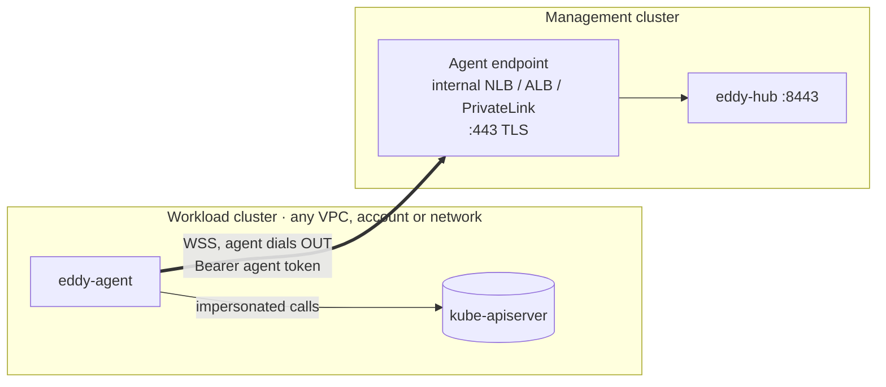

# The agent: permissions, guardrails and connectivity

One `eddy-agent` runs in every workload cluster. It watches Flux and workloads and sends
summaries to the hub. It also carries out reads and actions *as the signed-in user*.

## Where it runs

Install it in its **own namespace** (`eddy-system`), not in `flux-system`:
- Flux stays untouched and upgrades on its own schedule.
- RBAC, Pod Security and NetworkPolicy for the agent are isolated. Label the namespace
  `pod-security.kubernetes.io/enforce: restricted`, because the agent meets that profile.
- It still sees `flux-system` and every other namespace through its ClusterRole, or only
  the namespaces in `watch.namespaces`.

## What the pod can do

| Permission | Why | Guardrail |
|---|---|---|
| `get/list/watch` on Flux kinds, Deployments, StatefulSets, DaemonSets, ReplicaSets, Pods, Events, Namespaces | Informer cache | Read-only. Secrets and ConfigMaps are **not** in the role at all. |
| `create subjectaccessreviews` | Answers "may alice list HelmReleases in team-a?" for hub-side filtering | Asks the API server a question. Grants nothing. |
| `impersonate users`, `impersonate groups` | Every user read or action runs as that user, so the cluster's RBAC decides and its audit log shows the real user | See below. |
| Writes of its own | **None** | Reconcile and suspend work only if the *impersonated user* may `patch`. |

The pod runs as non-root with a read-only root filesystem, all capabilities dropped and
the RuntimeDefault seccomp profile. It has no Service and accepts **no inbound
connections**; the NetworkPolicy is egress-only.

### Impersonation: the one powerful permission

Impersonation is what makes "Kubernetes RBAC is the only permission model" work. It is
also the agent's largest attack surface.

- **In code:** the agent refuses `system:*` users and groups, users matching
  `denyUserPrefixes`, and any group outside `allowedGroupPrefixes` (`eddy:`). The hub
  checks the same rules first.
- **In RBAC:** set `impersonation.groups` to the exact groups you use, for example
  `eddy:authenticated` and `eddy:platform`. The chart then pins the `impersonate groups`
  rule with `resourceNames`. With the pin, even a compromised agent pod cannot impersonate
  `system:masters` or any group you did not list. **We recommend setting this in every
  production cluster.**
- **Users** cannot be pinned by prefix in RBAC. A compromised agent could impersonate a
  user that has its own RoleBindings (for example an SSO user bound directly to
  `cluster-admin`). Mitigations:
  - Bind human access to **groups**, not to individual users.
  - Keep the agent namespace locked down: only platform admins may exec into it or read
    its Secrets.
  - Watch the cluster audit log for impersonation by the agent ServiceAccount.
  - Track upstream Kubernetes work on constrained impersonation, and adopt it when it is
    available.
- **Blast radius:** the agent token lets a caller register as *one* cluster name with
  the hub. A stolen token cannot reach other clusters. The hub holds no kube credentials.

## How it connects: outbound only

- **Transport:** the agent opens **one long-lived WebSocket over TLS**
  (`wss://…/agent/v1/connect`) and keeps it open. Traffic flows both ways over that one
  socket:
  - **Agent to hub:** it sends a snapshot on connect, then deltas batched every 250 ms.
  - **Hub to agent:** it sends requests down the same socket (reverse RPC), such as yaml,
    events, logs, reconcile, suspend and access checks. Each request carries the user's
    identity.
- **Pull or push?** Neither polling nor inbound push. It is an outbound tunnel, which is
  why it works behind NAT, firewalls and corporate proxies.
- **Keepalive and reconnect:** a ping every 20 s keeps load balancers with idle timeouts
  of 60 s or more happy. Reconnects use jittered backoff up to 30 s. A reconnect sends a
  fresh snapshot, so nothing is lost.
- **Frames:** JSON, at most 1 MiB each. Large snapshots are split into chunks. For scale,
  about 5,000 resources come to a few MB on connect and small deltas after that. Logs
  stream only while someone is viewing them.

### Firewall and security groups

| Side | Inbound | Outbound |
|---|---|---|
| Workload cluster (agent) | **nothing** | TCP 443 to the hub's agent endpoint, plus DNS and the kube API |
| Management cluster (hub) | TCP 443 on the **agent endpoint only**, from the agent networks | kube API, DNS, the AI provider if used |

The UI and API endpoint is a separate listener and hostname. It can stay reachable from
the corporate network only.

### Connectivity recipes

| Where the workload cluster is | Recommended path |
|---|---|
| Same VPC as the hub | Internal NLB or ALB. The security group allows 443 from the node or pod CIDRs. |
| Other VPC, same account | VPC peering or Transit Gateway to the internal agent endpoint |
| **Other AWS account** | **PrivateLink.** Put the hub's agent NLB behind a VPC endpoint service and create an interface endpoint in each workload VPC. This needs no peering, tolerates overlapping CIDRs, and you allowlist accounts on the endpoint service. |
| Other cloud, on-prem, a laptop or kind | A public agent endpoint restricted by source CIDR (TLS plus token; mTLS in v1.1), or a tunnel such as Tailscale or Cloudflare Tunnel. Only the agent side needs outbound access. |
| Behind an egress proxy | The agent honours `HTTPS_PROXY` and `NO_PROXY`. Keep the kube API in `NO_PROXY`. |

### What travels over the wire

- **Sent:** resource summaries (`internal/model.Resource`): kind, name, status,
  conditions, revision, source, owner, images, replica counts. Also redacted YAML,
  events, and log lines while someone is viewing them.
- **Never sent:** Secret or ConfigMap data, `managedFields`, env values, or kubeconfigs
  and credentials.
- **Protection:** TLS protects the channel. The hub pins the token to the Cluster name, and
  the agent can pin the hub's CA with `hub.caBundle`. Mutual TLS arrives in v1.1.

## Replicas and control-plane protection

The chart runs **two agent replicas** by default (`replicaCount`), spread across nodes
(preferred anti-affinity) with a PodDisruptionBudget of `maxUnavailable: 1`.

- **Each replica is a full agent:** it watches the cluster, keeps its own informer cache and
  holds its own WebSocket to the hub. It introduces itself with a random `instance` id,
  chosen once per process, and a `seq` that counts its dials.
- **One cluster, several sessions:** the hub builds the cluster's view from one session (on
  each hub replica, the oldest synced one connected to it, or else a relay to the replica
  that has one) and keeps the others as hot standbys. When the primary goes away, a standby
  takes over at once and the cluster does not show as `Disconnected`.
- **Reconnects:** the same instance reconnecting with a higher `seq` replaces its old
  connection on every hub replica. A dial with a lower `seq` than an existing connection is
  refused.
- **Cost:** every replica runs its own watches, so N replicas mean N times the watch
  connections. Watches are cheap; two replicas is the default.

Eddy must never overload a cluster's control plane, so the agent enforces limits closest to
the API server. They apply per agent process; the chart's `limits.*` values are for the
whole Deployment and it divides them by `replicaCount` (rounding down, at least 1):

| Chart value (default) | Environment variable | What it limits |
|---|---|---|
| `limits.qps` (20) | `EDDY_KUBE_QPS` | client-go QPS. One token bucket for the agent's own clients (discovery, informers, SubjectAccessReviews) and a separate one shared by every impersonated client. |
| `limits.burst` (40) | `EDDY_KUBE_BURST` | client-go burst, for both buckets. |
| `limits.concurrency` (16) | `EDDY_MAX_CONCURRENT` | User requests in flight. More get a 503. |
| `limits.logStreams` (8) | `EDDY_MAX_LOG_STREAMS` | Log streams in flight, counted within the requests. |
| `limits.sarConcurrency` (8) | `EDDY_MAX_SAR_CONCURRENT` | SubjectAccessReviews in flight across all access checks. |

A request also carries at most 100 access checks. The hub adds its own limits on top
(per-user rates, SSE and log-stream caps, the 45 s access-check cache).

Agent replicas need a hub that understands `instance` and `seq`. An older agent sends
neither; the hub then treats every connection of that cluster as one instance whose newest
connection wins, so run only one replica of an older agent.

## Hardening checklist

- [ ] Install the agent in its own namespace, labelled with Pod Security `restricted`.
- [ ] Set `impersonation.groups` so group impersonation is pinned.
- [ ] Bind people to `eddy:`-prefixed groups, not to individual users.
- [ ] Enable `networkPolicy` (egress only) and set `hubTo` to the hub endpoint's CIDR.
- [ ] Use PrivateLink or a private path. If the agent endpoint must be public, restrict it by source CIDR.
- [ ] Rotate the agent token (`token` → `previousToken`), as described in [install.md](install.md).
- [ ] Alert on impersonation by `system:serviceaccount:eddy-system:eddy-agent` in the cluster audit logs.
