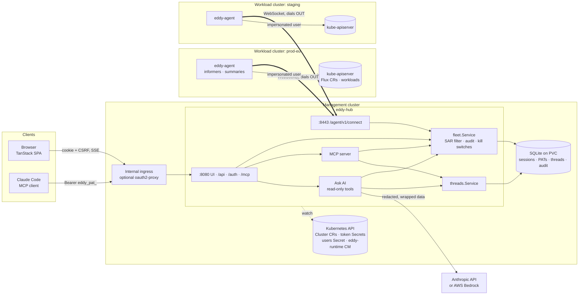
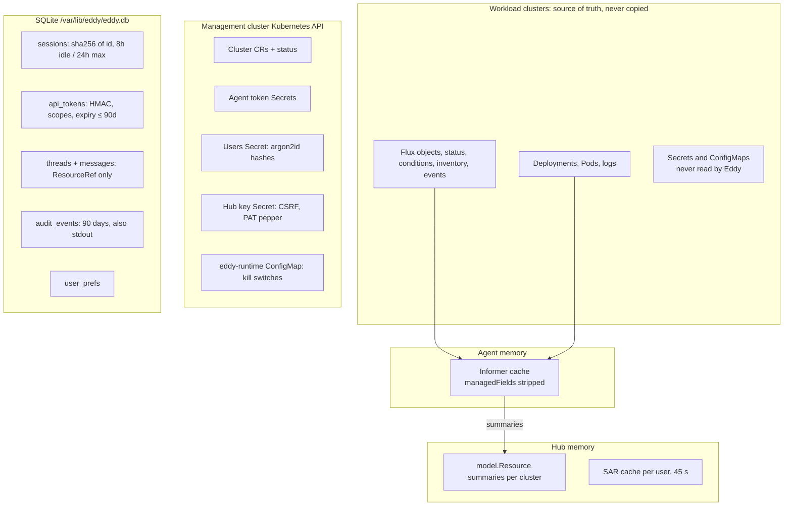
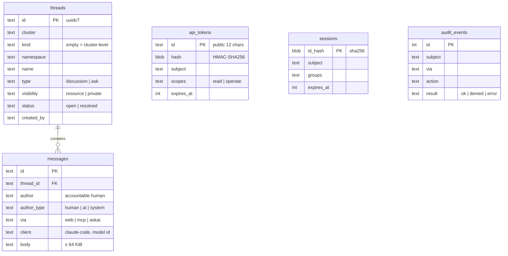
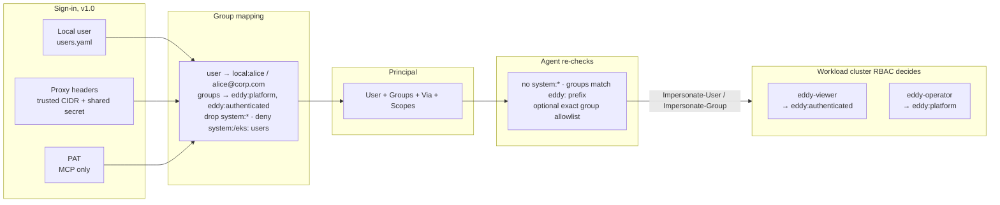
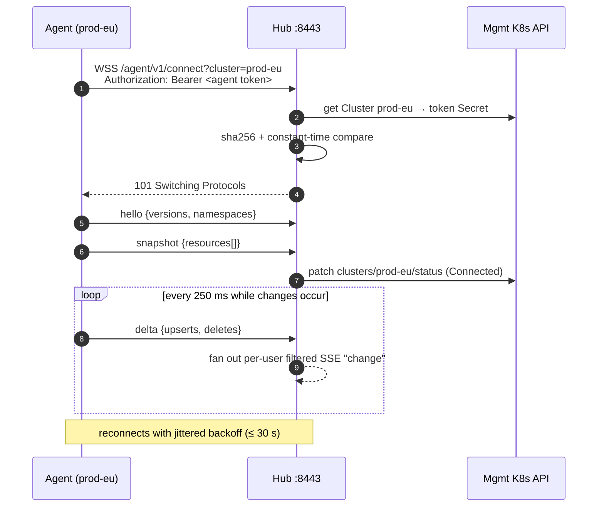
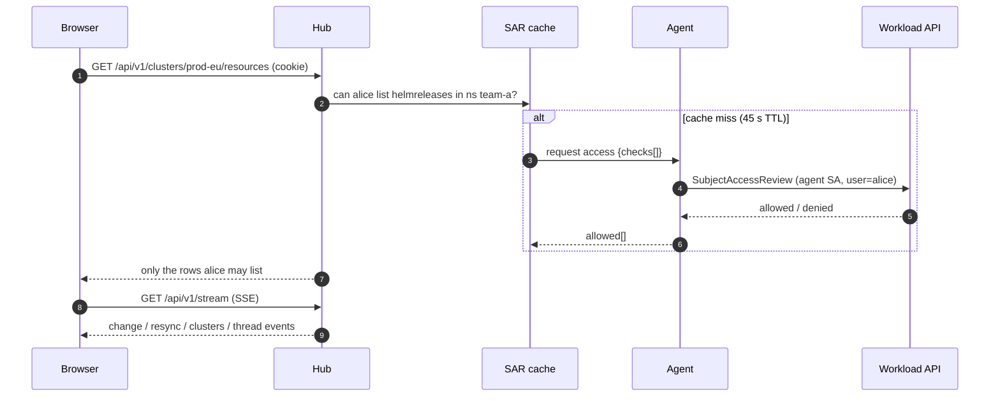
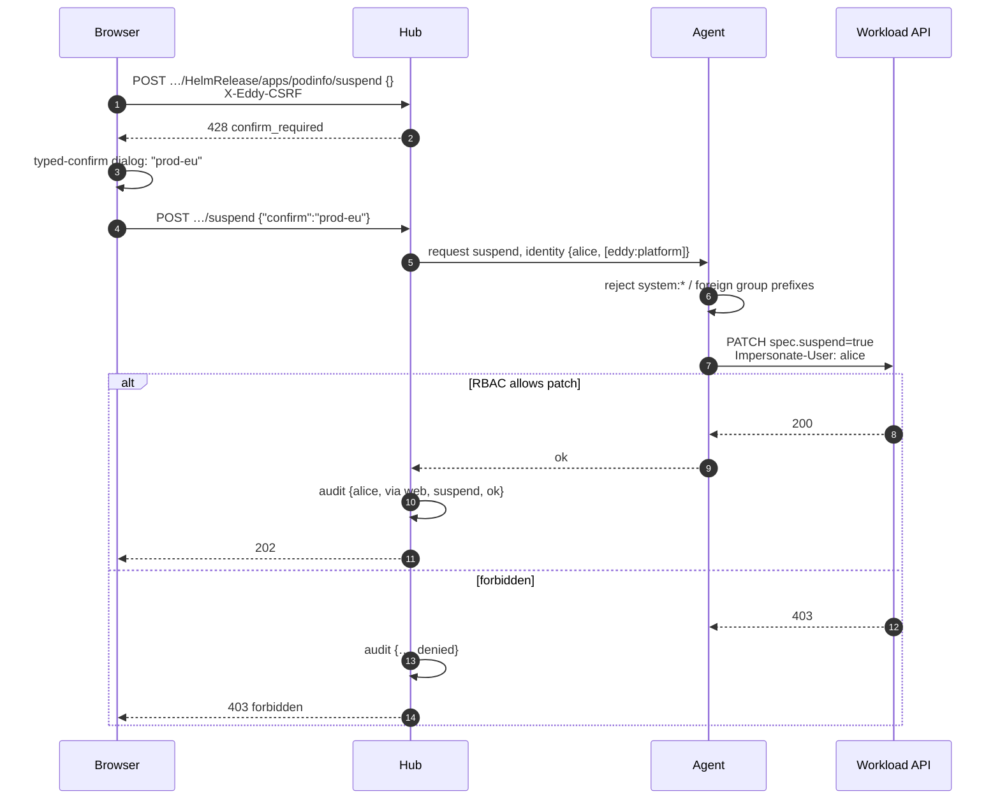
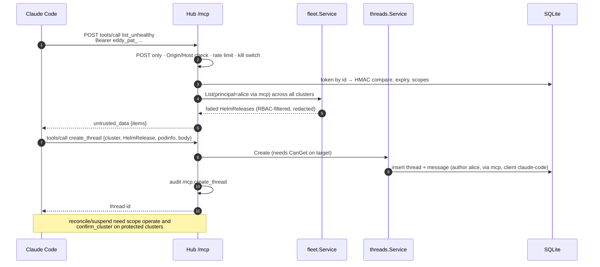
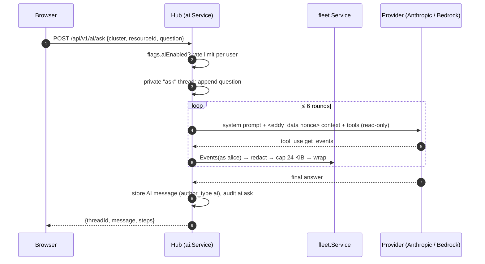

# Architecture

This page shows Eddy's architecture, access model and main flows as diagrams. The reasons
behind each choice are in [ADR-0001](adr/0001-hub-agent-architecture.md),
[ADR-0002](adr/0002-hub-storage.md) and [ADR-0003](adr/0003-mvp-security.md). The exact
endpoints are in [api.md](api.md).

## Components



**Rules**
- Agents dial out, so workload API servers are never exposed.
- The hub holds no workload-cluster credentials.
- Only summaries leave a cluster.

## Where data lives





## Identity and permissions



| Who | Channel | Can read | Can act (reconcile / suspend / resume) | Threads |
|---|---|---|---|---|
| Browser user | cookie session | whatever their RBAC allows | if RBAC allows `patch`; protected clusters need the cluster name typed in | read, write, resolve (author or `patch`) |
| PAT with `read` | `/mcp` | whatever their RBAC allows | no | read and write |
| PAT with `operate` | `/mcp` | whatever their RBAC allows | if RBAC allows, `mcp.writes` is on, and `confirm_cluster` is given on protected clusters | read and write |
| Ask AI | server-side | the asking user's RBAC view, redacted | **never** (no write tools) | writes only its own private `ask` thread |
| Agent ServiceAccount | in cluster | get/list/watch on Flux kinds, workloads and pods | **none**: only `impersonate` and SubjectAccessReviews | n/a |
| Hub ServiceAccount | management cluster | Cluster CRs, Secrets in its own namespace | patch `clusters/status` only | n/a |

## Flows

### Agent connects



### Browser reads (RBAC-filtered, shared cache)



### Action on a protected cluster



### Claude Code over MCP, with review threads



### Ask AI (Anthropic or Bedrock)



### Sign-in modes (v1.0)

```mermaid
sequenceDiagram
  autonumber
  participant U as Browser
  participant O as oauth2-proxy (optional)
  participant H as Hub
  alt Local users
    U->>H: GET /auth/csrf → pre-session cookie
    U->>H: POST /auth/local/login {user, pass} + CSRF
    H->>H: rate limit · argon2id verify (dummy hash if unknown)
    H-->>U: Set-Cookie __Host-eddy_session (rotated id)
  else Trusted proxy
    U->>O: request (IdP SSO: Google / Okta / GitHub)
    O->>H: X-Forwarded-Email/Groups + X-Eddy-Proxy-Secret
    H->>H: peer in trustedCIDRs AND secret matches? else strip
    H-->>U: session minted; dropped if header identity changes
  end
  Note over U,H: Native OIDC / SAML / GitHub OAuth are planned for v1.1
```
